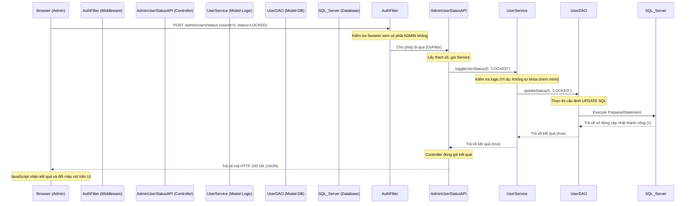

# Kịch bản Review Code dành cho Admin (Dự án Bán Hoa Quả Online)

Đây là kịch bản chi tiết giúp bạn tự tin trả lời giảng viên khi bị hỏi về luồng code MVC của các chức năng Admin mà bạn phụ trách.

## 1. Trả lời Câu hỏi Tổng quan (Giới thiệu bản thân)
> **Giảng viên:** "Dự án của em dùng công nghệ gì và em phụ trách phần nào?"

**Bạn trả lời:**
"Dạ thưa thầy/cô, dự án của nhóm em được xây dựng trên nền tảng **Java Web truyền thống** sử dụng kiến trúc **MVC (Model-View-Controller)**. 
- Công nghệ chính gồm: **Jakarta Servlet 6, JSP/JSTL, và Tomcat 10**.
- Database chúng em dùng là **SQL Server** và truy vấn qua **JDBC** thuần (sử dụng PreparedStatement để chống SQL Injection).
- Trong dự án này, em đảm nhận vai trò code chính cho **Actor Admin**, bao gồm các chức năng quản lý người dùng (Block/Unblock tài khoản), giám sát đơn hàng toàn hệ thống, quản lý đối soát thanh toán và phê duyệt các yêu cầu hoàn trả (Refund)."

---

## 2. Giải thích Luồng MVC qua chức năng "Khóa tài khoản User" (Block User)

Giảng viên thường sẽ yêu cầu bạn mở 1 chức năng bất kỳ và bảo: *"Em hãy trace code luồng chạy của chức năng này từ lúc bấm nút cho đến DB cho tôi xem."*
Hãy mở chức năng **Khóa/Mở Khóa User** và trình bày theo sơ đồ sau:

### Cách bạn vừa chỉ code vừa nói:
1. **Mở trình duyệt:** "Thưa thầy, khi em bấm nút Khóa tài khoản trên giao diện (View), trình duyệt sẽ gửi một request `POST` kèm theo ID của user cần khóa."
2. **Mở file `AuthFilter.java` & `RoleFilter.java`:** "Trước khi vào Servlet, request phải đi qua Filter để kiểm tra xem tài khoản đang đăng nhập có đúng là Role `ADMIN` hay không."
3. **Mở file `AdminUserStatusAPI.java` (Controller):** "Tại Controller, hàm `doPost` sẽ tiếp nhận request. Nó không tự gọi Database mà sẽ chuyển dữ liệu xuống tầng Service."
4. **Mở file `UserService.java` (Business Logic):** "Ở tầng Service, em viết các luật nghiệp vụ (ví dụ kiểm tra Admin không được tự khóa tài khoản của chính mình). Sau khi qua kiểm duyệt, nó mới gọi DAO."
5. **Mở file `UserDAO.java` (Data Access):** "Tại DAO, em sử dụng `PreparedStatement` với câu lệnh `UPDATE users SET status = ? WHERE id = ?`. Em dùng khối lệnh `try-with-resources` để đảm bảo Connection luôn được đóng sau khi truy vấn xong, tránh tràn bộ nhớ."

---

## 3. Các câu hỏi "Bắt lỗi" kinh điển của Giảng viên và cách đỡ

**Q: Tại sao phải chia ra Service và DAO? Gộp chung vào Servlet gọi thẳng Database được không?**
> **A:** "Dạ về mặt chạy thì gộp vào vẫn chạy được, nhưng vi phạm nguyên tắc thiết kế Single Responsibility (Đơn trách nhiệm) và làm code khó bảo trì. Servlet chỉ nên làm nhiệm vụ điều hướng (nhận Request, trả Response). Service để xử lý luật nghiệp vụ, còn DAO chỉ thuần túy làm việc với câu lệnh SQL. Chia như vậy để sau này dễ tái sử dụng code và dễ viết Unit Test."

**Q: PreparedStatement là gì? Tại sao không dùng Statement nối chuỗi bình thường?**
> **A:** "Dạ dùng PreparedStatement giúp hệ thống chống lại lỗ hổng bảo mật **SQL Injection**. Cơ sở dữ liệu sẽ biên dịch trước câu lệnh SQL (Pre-compile), các tham số em truyền vào qua dấu `?` chỉ được xem là giá trị thuần túy, không thể làm thay đổi cấu trúc của câu truy vấn."

**Q: Làm sao em quản lý được transaction (giao dịch) nếu DAO lỗi giữa chừng? (Ví dụ chức năng Refund)**
> **A:** "Với những luồng phức tạp như Refund (Vừa phải cập nhật trạng thái đơn, vừa phải cộng tiền), em thiết lập `connection.setAutoCommit(false);` ở đầu hàm. Sau khi cả 2 lệnh UPDATE chạy xong thì em mới gọi `connection.commit();`. Nếu có bất kỳ Exception nào ném ra giữa chừng, hệ thống sẽ rơi vào hàm `catch` và gọi `connection.rollback();` để hủy bỏ toàn bộ, đảm bảo tính toàn vẹn dữ liệu (ACID)."

**Q: Mật khẩu lưu trong Database là text thuần (plain text) hay có mã hóa?**
> **A:** "Dạ mật khẩu của hệ thống em được băm (hash) bằng thuật toán mã hóa (VD: BCrypt hoặc SHA) trước khi lưu xuống bảng `users`. Controller không bao giờ xử lý trực tiếp plain-text xuống DAO."

---

## 4. Bí kíp "Sống sót" cuối cùng
1. **Tuyệt đối không nói "Em dùng AI để code 100%".** Hãy nói: "Em tự design kiến trúc, tự phân tầng DAO/Service/Servlet và có sử dụng AI làm trợ lý (Copilot/Tabnine) để hỗ trợ gen các đoạn mã lặp lại (boilerplate code) cho nhanh."
2. Hãy mở sẵn NetBeans ở các file bạn hiểu rõ nhất (như `UserService` hoặc `AdminOrderServlet`).
3. Chuẩn bị sẵn file `database/Schema.sql` để khi thầy hỏi "Bảng đơn hàng thiết kế thế nào?", bạn có thể mở ra ngay lập tức.
