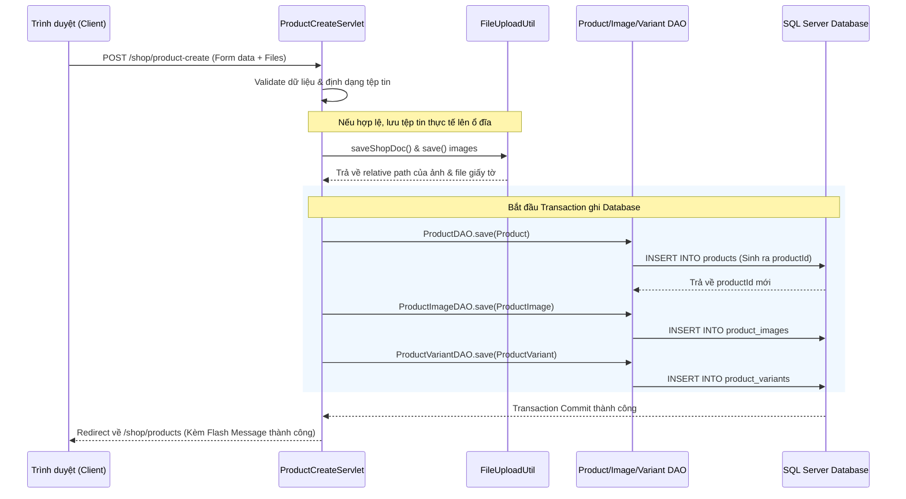

# Chức năng 1: Thêm mới sản phẩm (Có upload hình ảnh và lưu Database)

## 1. Thông tin chung
*   **Tên chức năng:** Thêm mới sản phẩm và tải lên tài liệu xác nhận nông sản sạch/hữu cơ.
*   **Đối tượng sử dụng (Actor):** Chủ cửa hàng (Shop Owner).
*   **Mục tiêu:** Cho phép chủ cửa hàng đăng bán sản phẩm hoa quả mới kèm theo nhiều hình ảnh mô tả, giá cả, các biến thể đóng gói (variants), bao bì tự chọn, và tài liệu chứng thực nông sản sạch (hữu cơ, nhập khẩu) lên hệ thống.

---

## 2. Luồng hoạt động chi tiết (Workflow Flow)


### Các bước thực hiện:
1.  **Client (Giao diện):** Chủ shop truy cập form thêm mới sản phẩm, điền các thông tin (tên, danh mục, xuất xứ, hạn sử dụng...), thêm các phân loại/biến thể (cân nặng, giá bán), chọn tài liệu chứng thực (PDF/Ảnh) và tải lên các ảnh mô tả sản phẩm. Bấm nút **"Lưu sản phẩm"** (Yêu cầu gửi đi dưới dạng `multipart/form-data`).
2.  **Controller (`ProductCreateServlet`):**
    *   Xác thực người dùng là Shop Owner.
    *   Đọc và kiểm tra tính hợp lệ của dữ liệu đầu vào (tên sản phẩm không trống, giá biến thể phải > 0, định dạng ngày thu hoạch...).
    *   Kiểm tra định dạng tệp tải lên (chỉ cho phép tệp ảnh: `jpg, jpeg, png, webp` và tài liệu: `pdf, docx, png, jpg`).
3.  **Service/Util (`FileUploadUtil`):**
    *   Lưu tài liệu chứng thực nông sản sạch qua `saveShopDoc()` vào thư mục an toàn trên server.
    *   Lưu danh sách hình ảnh qua `save()` vào thư mục upload của ứng dụng.
4.  **DAO Layer (`ProductDAO`, `ProductImageDAO`, `ProductVariantDAO`, `ProductPackagingOptionDAO`):**
    *   **Thêm sản phẩm:** Gọi `ProductDAO.save` để thêm thông tin cơ bản và đường dẫn file tài liệu chứng thực vào bảng `products`. Truy vấn lấy về `product_id` tự động sinh.
    *   **Thêm ảnh:** Lặp qua các ảnh đã lưu thành công, tạo đối tượng `ProductImage` và gọi `ProductImageDAO.save()` để ghi vào bảng `product_images`.
    *   **Thêm biến thể:** Lặp qua danh sách phân loại (SKU, giá bán, trọng lượng, giá khuyến mãi) và gọi `ProductVariantDAO.save()` để ghi vào bảng `product_variants`.
    *   **Thêm bao bì tùy chọn:** Lưu các bao bì đính kèm tùy chọn vào bảng `product_packaging_options`.
5.  **Database:** Lưu toàn bộ thông tin. Nếu có bất kỳ lỗi SQL nào xảy ra, cơ chế Transaction sẽ Rollback toàn bộ dữ liệu để tránh tình trạng sản phẩm bị tạo lỗi (ví dụ: có sản phẩm nhưng thiếu biến thể hoặc thiếu ảnh).

---

## 3. Cấu trúc Database liên quan
*   **Bảng `products`:** Lưu thông tin chung của sản phẩm (tên, xuất xứ, tài liệu chứng thực, trạng thái duyệt).
*   **Bảng `product_images`:** Lưu danh sách các ảnh của sản phẩm, thứ tự hiển thị, và đánh dấu ảnh chính (`is_primary`).
*   **Bảng `product_variants`:** Lưu các phân loại của sản phẩm (SKU, nhãn phân loại, giá bán, cân nặng, khuyến mãi).
*   **Bảng `product_packaging_options`:** Lưu các tùy chọn đóng gói/hộp quà đi kèm sản phẩm.

---

## 4. Các câu lệnh SQL chính
```sql
-- 1. Insert thông tin sản phẩm mới
INSERT INTO products (
    owner_id, category_id, name, description, origin_country, 
    origin_region, harvest_date, shelf_life_days, storage_instruction, 
    status, is_organic, is_imported, approval_status, verification_doc_path
) VALUES (?, ?, ?, ?, ?, ?, ?, ?, ?, 'ACTIVE', ?, ?, ?, ?);

-- 2. Insert hình ảnh sản phẩm
INSERT INTO product_images (
    product_id, file_path, display_order, is_primary
) VALUES (?, ?, ?, ?);

-- 3. Insert biến thể sản phẩm
INSERT INTO product_variants (
    product_id, sku, variant_label, price, stock_quantity, 
    weight_kg, discount_price, discount_start, discount_end, is_active
) VALUES (?, ?, ?, ?, 0, ?, ?, ?, ?, 1);
```

---

## 5. Các trường hợp lỗi & Cách xử lý (Error Handling)
1.  **Lỗi tệp tin quá lớn hoặc sai định dạng:** Hệ thống ném lỗi tại Servlet và hiển thị thông báo: *"Giấy tờ xác nhận nông sản không đúng định dạng..."* hoặc *"Tệp tin không phải là định dạng ảnh được phép"*. Form sẽ giữ lại các thông tin text cũ (Old Input) để người dùng không phải điền lại từ đầu.
2.  **Lỗi kết nối cơ sở dữ liệu (`SQLException`):** Rollback toàn bộ transaction, xóa các file ảnh thực tế đã tải lên ổ đĩa của server để tránh rác hệ thống, ghi nhận nhật ký lỗi bằng `LoggerUtil.error`, hiển thị thông báo lỗi thân thiện cho chủ shop.
