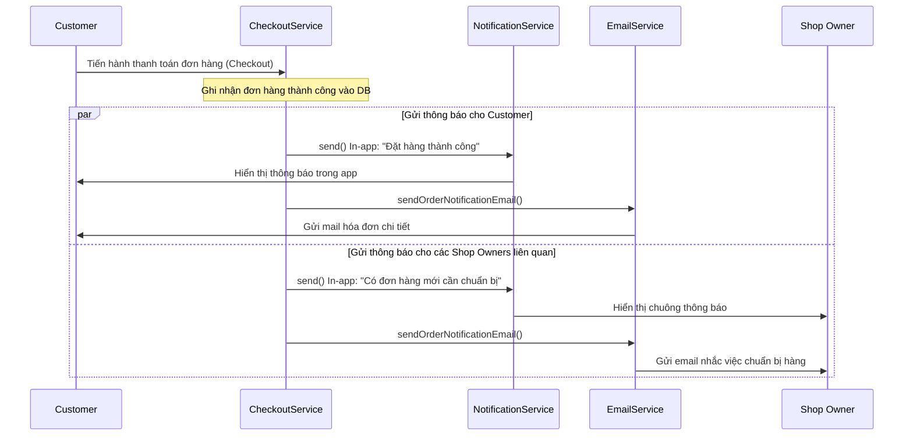

# Chức năng 6: Hệ thống gửi Email và Thông báo in-app khi tạo đơn hàng thành công

## 1. Thông tin chung
*   **Tên chức năng:** Gửi thông báo trong ứng dụng (In-app notification) và Thư điện tử (Email) khi hoàn tất đặt hàng.
*   **Đối tượng sử dụng (Actor):** Hệ thống (System) gửi cho Khách hàng (Customer) và Chủ shop (Shop Owner).
*   **Mục tiêu:** Xác nhận việc đặt hàng thành công đến khách hàng và gửi thông báo chuẩn bị đơn hàng tức thời đến các chủ shop có sản phẩm liên quan.

---

## 2. Luồng hoạt động chi tiết (Workflow Flow)


### Các bước thực hiện:
1.  **Giao dịch thành công:** Khách hàng hoàn tất bước thanh toán đơn hàng. Tiến trình xử lý tại `CheckoutService` ghi nhận thành công và thực hiện commit Transaction lưu thông tin đơn hàng.
2.  **Hệ thống xử lý thông báo:**
    *   **Gửi cho Customer (Người mua):**
        *   Hệ thống gọi `NotificationService.send` để lưu bản ghi thông báo loại `NOTIF_ORDER_UPDATE` (Đặt hàng thành công) vào bảng `notifications`.
        *   Đồng thời gọi `EmailService.sendOrderNotificationEmail()` truyền vào thông tin người nhận, tiêu đề và liên kết chi tiết đơn hàng để gửi thư điện tử xác nhận.
    *   **Gửi cho các Shop Owners (Người bán):**
        *   Do giỏ hàng có thể chứa các mặt hàng từ nhiều nhà bán lẻ khác nhau, hệ thống phân tích đơn hàng và gom nhóm các sản phẩm theo chủ sở hữu (`ownerId`).
        *   Với mỗi shop con, hệ thống ghi nhận thông báo in-app: *"Có đơn hàng mới cần chuẩn bị (Đơn hàng con #X)"*.
        *   Gửi email thông báo nhắc nhở chuẩn bị đóng gói hàng hóa đến địa chỉ email của chủ shop.

---

## 3. Cấu trúc Database liên quan
*   **Bảng `notifications`:** Lưu các thông báo hiển thị trên ứng dụng web:
    *   `notification_id` (INT - Khóa chính)
    *   `user_id` (INT - Người nhận thông báo)
    *   `type` (VARCHAR - Nhóm thông báo, ở đây là `'ORDER_UPDATE'`)
    *   `title` (NVARCHAR - Tiêu đề)
    *   `message` (NVARCHAR - Nội dung chi tiết)
    *   `action_url` (VARCHAR - Link điều hướng khi click vào thông báo)
    *   `is_read` (BIT - Trạng thái đã đọc)

---

## 4. Các câu lệnh SQL chính
```sql
-- Lưu thông báo in-app cho người dùng (Khách hàng hoặc Chủ shop)
INSERT INTO notifications (
    user_id, type, title, message, action_url, is_read, created_at
) VALUES (?, 'ORDER_UPDATE', ?, ?, ?, 0, GETDATE());
```

---

## 5. Các trường hợp lỗi & Cách xử lý (Error Handling)
1.  **Lỗi gửi mail chậm hoặc thất bại:** Do việc kết nối đến SMTP Mail Server bên ngoài có thể bị chậm hoặc gián đoạn, hệ thống bọc lệnh gửi email trong khối `try-catch`. Nếu email lỗi, chương trình ghi log cảnh báo bằng `LoggerUtil.warn` nhưng **không làm gián đoạn luồng đặt hàng chính** của khách hàng (giao diện đặt hàng vẫn hiển thị thành công).
2.  **Thông tin địa chỉ email không đúng:** Nếu địa chỉ email người dùng không hợp lệ, hệ thống bỏ qua và ghi nhận lỗi để tránh dừng đột ngột ứng dụng.
