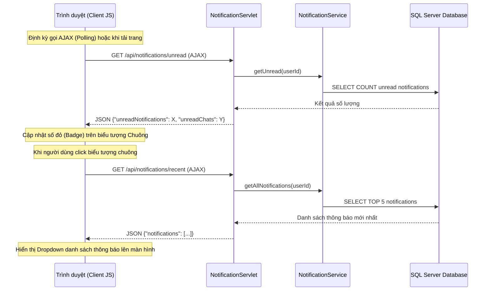

# Chức năng 11: Chuông thông báo thời gian thực và dropdown xem nhanh trên Header

## 1. Thông tin chung
*   **Tên chức năng:** Badge đếm số thông báo và Dropdown danh sách thông báo trên thanh điều hướng (Header/Navbar).
*   **Đối tượng sử dụng (Actor):** Khách hàng, Chủ shop, Admin.
*   **Mục tiêu:** Cung cấp trải nghiệm cập nhật thông tin nhanh chóng, hiển thị trực tiếp số lượng thông báo chưa đọc và cho phép xem nhanh nội dung thông báo ngay tại Header mà không cần tải lại trang.

---

## 2. Luồng hoạt động chi tiết (Workflow Flow)


### Các bước thực hiện:
1.  **AJAX Polling (Tự động cập nhật):**
    *   Trong file `navbar.jsp`, mã JavaScript chạy ngầm sẽ định kỳ gửi request GET đến `/api/notifications/unread`.
    *   `NotificationServlet` nhận request, gọi `NotificationService.getUnread(userId)` và đếm tổng số thông báo chưa đọc.
    *   Servlet phản hồi dữ liệu dạng JSON. Trình duyệt nhận kết quả, nếu số lượng > 0 sẽ cập nhật số đỏ (badge) hiển thị đè lên biểu tượng hình quả chuông.
2.  **Dropdown hiển thị nhanh (Click hiển thị):**
    *   Khi người dùng click vào biểu tượng quả chuông trên Header, JavaScript sẽ ngăn chặn chuyển trang và thực hiện gửi request GET đến `/api/notifications/recent`.
    *   Servlet trả về danh sách 5 thông báo mới nhất dưới dạng JSON.
    *   JavaScript render động danh sách này vào khung Dropdown dưới dạng HTML (hiển thị tiêu đề, nội dung rút gọn, thời gian nhận thông báo).
3.  **Hành động đọc nhanh (Mark Read / Delete):**
    *   *Đọc thông báo:* Khi click vào một dòng thông báo, JavaScript gửi yêu cầu POST đến `/api/notifications/markRead?notifId=X`, cập nhật trạng thái `is_read = 1` trong DB, đồng thời điều hướng người dùng tới liên kết của thông báo đó (`action_url`).
    *   *Xóa thông báo:* Bấm nút "x" nhỏ bên cạnh thông báo sẽ gửi yêu cầu POST đến `/api/notifications/delete?notifId=X` để xóa thông báo ngay lập tức mà không tải lại trang.

---

## 3. Cấu trúc Database liên quan
*   **Bảng `notifications`:** Cập nhật trạng thái `is_read` và thời gian gửi thông báo.
*   **Bảng `chat_messages` / `chats`:** Dùng để đếm số lượng tin nhắn chat chưa đọc song song với thông báo hệ thống.

---

## 4. Các câu lệnh SQL chính
```sql
-- 1. Lấy số lượng thông báo chưa đọc của user
SELECT COUNT(*) FROM notifications WHERE user_id = ? AND is_read = 0;

-- 2. Lấy danh sách thông báo gần đây của user
SELECT * FROM notifications 
WHERE user_id = ? 
ORDER BY created_at DESC;

-- 3. Đánh dấu đã đọc thông báo
UPDATE notifications SET is_read = 1 WHERE notification_id = ?;

-- 4. Xóa thông báo
DELETE FROM notifications WHERE notification_id = ?;
```

---

## 5. Các trường hợp lỗi & Cách xử lý (Error Handling)
1.  **Người dùng chưa đăng nhập:** Nếu gọi API khi session đã hết hạn hoặc chưa đăng nhập, Servlet sẽ phản hồi mã trạng thái HTTP `401 Unauthorized` dưới dạng JSON. JavaScript trên client bắt sự kiện này và tự động ẩn chuông thông báo hoặc chuyển hướng an toàn về trang login.
2.  **Lỗi đồng bộ dữ liệu:** Trong trường hợp đường truyền mạng chập chờn, yêu cầu AJAX bị timeout, hệ thống sẽ bỏ qua lỗi hiển thị badge và thử lại ở chu kỳ tiếp theo để tránh gây đơ giao diện người dùng.
