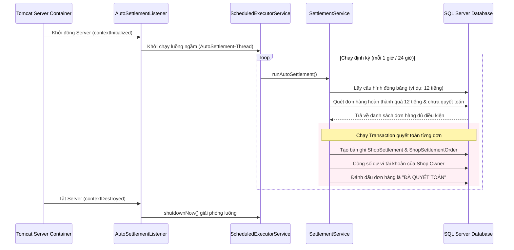

# Chức năng 15: Tiến trình chạy ngầm tự động đối soát và quyết toán đơn hàng hoàn thành (Auto-Settlement Background Job)

## 1. Thông tin chung
*   **Tên chức năng:** Lịch chạy ngầm tự động đối soát đơn hàng (Auto-Settlement Background Job).
*   **Đối tượng sử dụng (Actor):** Hệ thống chạy ngầm (System Daemon Job).
*   **Mục tiêu:** Tự động kết chuyển dòng tiền của các đơn hàng đã giao thành công (sau khi hết thời gian đóng băng bảo hành đổi trả) thành các kỳ đối soát và số dư khả dụng của Shop Owner mà không cần sự can thiệp thủ công của Admin.

---

## 2. Luồng hoạt động chi tiết (Workflow Flow)


### Các bước thực hiện:
1.  **Đăng ký và khởi động (`AutoSettlementListener`):**
    *   Lớp `AutoSettlementListener` implements `ServletContextListener` và được đánh dấu `@WebListener`. Khi Tomcat Server được khởi động, sự kiện `contextInitialized` được kích hoạt.
    *   Hệ thống khởi tạo một `ScheduledExecutorService` chạy dưới dạng một luồng ngầm (Daemon Thread) mang tên `AutoSettlement-Thread` để không làm nghẽn luồng xử lý Web chính.
2.  **Thiết lập chu kỳ chạy:**
    *   Lịch chạy được cài đặt độ trễ ban đầu là 10 giây (chờ máy chủ Tomcat khởi động hoàn tất các dịch vụ liên quan).
    *   Chu kỳ lặp lại được cấu hình chạy định kỳ (Ví dụ: mỗi 1 tiếng chạy quét một lần hoặc chạy 1 lần mỗi 24 tiếng tùy thuộc vào cài đặt hệ thống).
3.  **Xử lý nghiệp vụ đối soát (`SettlementService.runAutoSettlement`):**
    *   **Đọc cấu hình:** Lấy thời gian đóng băng đơn hàng an toàn (ví dụ: `settlement_freeze_hours` mặc định là 12 tiếng để chờ hết hạn đổi trả của khách hàng).
    *   **Quét đơn hàng:** Gọi `SettlementDAO.runAutoSettlementByHours` quét tất cả đơn hàng có trạng thái `DELIVERED` (Đã giao hàng) có thời gian hoàn thành trước thời gian đóng băng và chưa được đưa vào kỳ đối soát quyết toán nào.
    *   **Kết chuyển số dư:**
        *   Tạo kỳ đối soát `ShopSettlement` mới cho shop sở hữu đơn hàng.
        *   Tạo liên kết chi tiết đơn hàng đối soát `ShopSettlementOrder`.
        *   Tính toán số tiền shop nhận được sau khi trừ hoa hồng sàn (ví dụ: 5%). Cộng số dư tiền khả dụng vào tài khoản số dư của shop.
        *   Đánh dấu trạng thái quyết toán của đơn hàng thành công.
4.  **Hủy tiến trình giải phóng tài nguyên:**
    *   Khi ứng dụng Web tắt hoặc Tomcat Server dừng, sự kiện `contextDestroyed` được kích hoạt.
    *   Hệ thống tiến hành gọi lệnh `scheduler.shutdownNow()` để ngắt luồng chạy ngầm tức thì, ngăn chặn hiện tượng rò rỉ bộ nhớ (Memory Leak) trên máy chủ.

---

## 3. Cấu trúc Database liên quan
*   **Bảng `system_configs`:** Lưu trữ tham số đóng băng quyết toán `settlement_freeze_hours`.
*   **Bảng `orders`:** Cột trạng thái và ngày cập nhật hoàn thành đơn hàng.
*   **Bảng `shop_settlements`:** Lưu trữ thông tin kỳ quyết toán của từng shop (mã đối soát, tổng doanh thu, thực nhận, trạng thái đối soát: `pending`, `processed`).
*   **Bảng `shop_settlement_orders`:** Chi tiết các đơn hàng nằm trong kỳ đối soát đó.
*   **Bảng `shop_owner_profiles`:** Lưu số tiền dư tài khoản ví của chủ cửa hàng.

---

## 4. Các câu lệnh SQL chính
```sql
-- 1. Quét các đơn hàng đã hoàn thành quá thời gian đóng băng (ví dụ: 12 tiếng) và chưa từng quyết toán
SELECT order_id, total_amount, owner_id 
FROM orders 
WHERE status = 'DELIVERED' 
  AND updated_at <= DATEADD(HOUR, -12, GETDATE())
  AND order_id NOT IN (SELECT order_id FROM shop_settlement_orders);

-- 2. Tạo bản ghi kỳ quyết toán mới cho shop
INSERT INTO shop_settlements (shop_owner_id, total_revenue, platform_fee, net_payout, status, created_at)
VALUES (?, ?, ?, ?, 'processed', GETDATE());

-- 3. Lưu liên kết đơn hàng đối soát
INSERT INTO shop_settlement_orders (settlement_id, order_id, amount)
VALUES (?, ?, ?);

-- 4. Cộng tiền vào ví số dư khả dụng của chủ cửa hàng
UPDATE shop_owner_profiles 
SET wallet_balance = wallet_balance + ?, updated_at = GETDATE()
WHERE user_id = ?;
```

---

## 5. Các trường hợp lỗi & Cách xử lý (Error Handling)
1.  **Lỗi tắt server đột ngột khi đang chạy quyết toán:** Nhờ cơ chế Database Transaction, nếu server bị sập giữa chừng, toàn bộ các cập nhật cộng tiền ví và đánh dấu trạng thái của đơn hàng đang dang dở sẽ tự động rollback. Khi server khởi động lại, Job chạy ngầm sẽ tự động quét và thực hiện đối soát lại từ đầu một cách an toàn.
2.  **Lỗi tranh chấp số dư ví (Race Condition):** Tiến trình được bọc trong block `synchronized (SettlementService.class)` để đảm bảo tại một thời điểm chỉ có duy nhất một luồng được phép tính toán số dư ví và đối soát, tránh việc cộng tiền trùng lặp hoặc sai lệch số dư.
