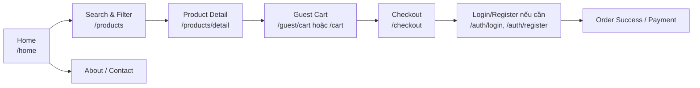
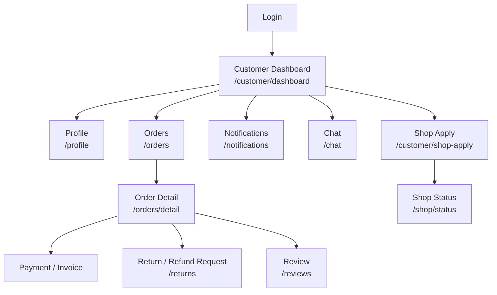
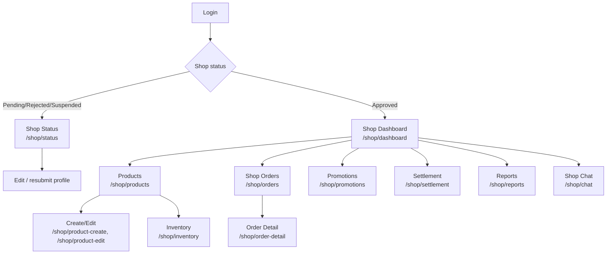
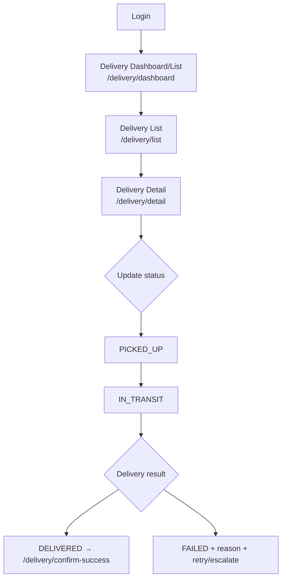
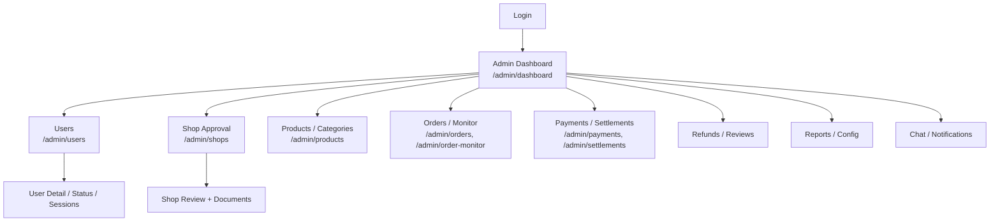
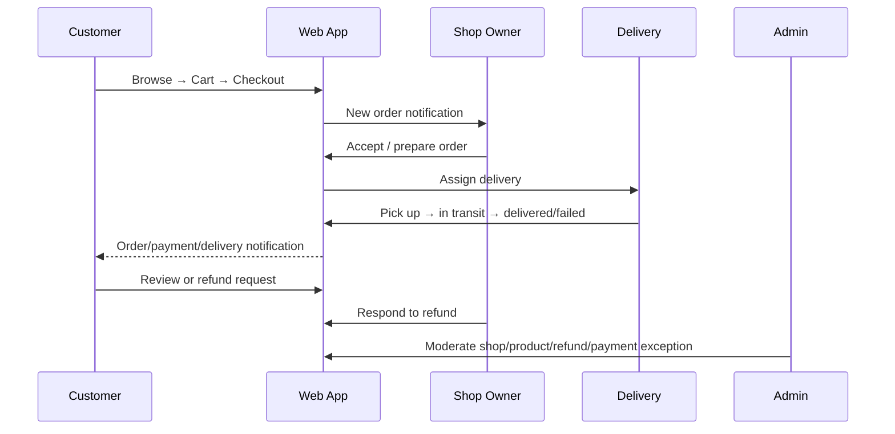

# Screen Flow & Actor Specification — Ban Hoa Qua Online

> **Mục đích:** Đặc tả screen flow dùng để review UI/UX, kiểm thử và đối chiếu trực tiếp với Servlet/JSP hiện có.
> **Nguồn sự thật:** route annotation trong `src/java`, JSP dưới `web/WEB-INF/jsp`, `AuthFilter`/`RoleFilter`, và domain role trong `AppConfig`.
> **Phạm vi:** Guest, Customer, Shop Owner, Delivery Staff, Admin; bao gồm các trạng thái lỗi và nhánh nghiệp vụ quan trọng.

## 1. Nguyên tắc tài liệu

- Mỗi màn hình có một mã `SCR-*`, actor, mục tiêu, entry route, JSP/servlet và outcome rõ ràng.
- POST/action phải theo PRG; route bảo vệ phải qua Auth/Role guard.
- Không coi tên trong sơ đồ mẫu là route thực tế nếu code đang dùng tên khác.
- UI phải có đủ trạng thái: loading, empty, error, success, disabled và permission denied.
- Mobile-first: vùng bấm tối thiểu 44px, bảng có cách đọc trên màn hình hẹp, trạng thái dùng cả màu và text.

## 2. Actor và vùng truy cập

| Actor | Role code | Vùng chính | Trang vào sau đăng nhập |
|---|---|---|---|
| Guest | chưa đăng nhập | `/home`, `/products`, `/cart`, auth | `/home` |
| Customer | `CUSTOMER` | mua hàng, đơn hàng, đánh giá, hoàn tiền, thông báo | `/customer/dashboard` |
| Shop Owner | `SHOP_OWNER` | shop, sản phẩm, đơn, tồn kho, khuyến mãi, settlement | `/shop/dashboard` hoặc `/shop/status` |
| Delivery Staff | `DELIVERY` | danh sách giao, chi tiết chuyến, cập nhật giao hàng | `/delivery/dashboard` |
| Admin | `ADMIN` | dashboard nền tảng, user/shop/product/order/payment/report | `/admin/dashboard` |

### Guard và redirect chuẩn

```mermaid
flowchart TD
    A[Request] --> B{AuthFilter}
    B -- public --> C[Guest route]
    B -- unauthenticated --> L[/auth/login]
    B -- authenticated --> D{RoleFilter / ActorAccessPolicy}
    D -- denied --> E[403 hoặc login]
    D -- CUSTOMER --> F[Customer area]
    D -- SHOP_OWNER --> G{Shop profile status}
    G -- pending/rejected/suspended --> H[/shop/status]
    G -- approved --> I[Shop workspace]
    D -- DELIVERY --> J[Delivery workspace]
    D -- ADMIN --> K[Admin workspace]
```

## 3. Global / Guest flow



| Mã | Màn hình | Route / source | Người dùng | Acceptance chính |
|---|---|---|---|---|
| `SCR-G01` | Home | `/home` → `guest/home.jsp` | Guest | Tìm kiếm, category, CTA vào listing; empty/error có hướng dẫn. |
| `SCR-G02` | Product Listing | `/products` → `guest/product-list.jsp` | Guest/Customer | Search, filter, sort, pagination; giữ query khi chuyển trang. |
| `SCR-G03` | Product Detail | `/products/detail`, `/product-detail` → `guest/product-detail.jsp` | Guest/Customer | Variant, ảnh, giá, tồn kho, add-to-cart; chặn quantity không hợp lệ. |
| `SCR-G04` | Public Shop | `/shop-view` → `shop/view.jsp` | Guest/Customer | Thông tin shop và sản phẩm active; không lộ dữ liệu quản trị. |
| `SCR-G05` | Cart | `/cart`, `/guest/cart` → `customer/cart.jsp` | Guest/Customer | Cập nhật quantity, remove, subtotal, empty state; đồng bộ guest state. |
| `SCR-G06` | Checkout | `/checkout` → `customer/checkout.jsp` | Customer/Guest chuyển login | Address, delivery, voucher, payment, quote; tổng tiền phải nhất quán. |
| `SCR-G07` | Auth | `/auth/login`, `/auth/register`, Google, verify, forgot/reset | Tất cả | Validation UTF-8, lỗi tại field, không mất intent checkout. |

## 4. Customer flow



| Mã | Màn hình | Route / JSP | Mục tiêu và nhánh bắt buộc |
|---|---|---|---|
| `SCR-C01` | Customer Dashboard | `/customer/dashboard` → `customer/dashboard.jsp` | Recent orders, voucher, shortcut; DB lỗi có flash + fallback. |
| `SCR-C02` | Cart / Checkout | `/cart`, `/checkout` → `customer/*.jsp` | Validate address, quote, payment method, unavailable product. |
| `SCR-C03` | Payment / Success | `/orders/detail` và payment routes → `order-payment.jsp`, `order-success.jsp` | Pending/paid/failed; không hiển thị success khi webhook chưa xác nhận. |
| `SCR-C04` | Order History | `/orders` → `customer/orders.jsp` | Filter status, stable pagination, total count. |
| `SCR-C05` | Order Detail | `/orders/detail` → `customer/order-detail.jsp` | Timeline, item, payment, delivery, invoice; action theo status. |
| `SCR-C06` | Return/Refund | `/returns` → `customer/return-request.jsp` | Chọn item, reason, evidence, time-window; trạng thái pending/approved/rejected. |
| `SCR-C07` | Review | `/customer/order-reviews`, `/reviews` → review JSPs | Chỉ review item đủ điều kiện và một lần; moderation outcome rõ. |
| `SCR-C08` | Notification | `/notifications` + notification APIs → `customer/notification.jsp` | Unread/read, filter, action URL, empty state. |
| `SCR-C09` | Profile | `/profile`, `/profile/order-detail` → common/customer JSP | Profile, address, password; không trộn quyền admin/shop. |
| `SCR-C10` | Shop Application | `/customer/shop-apply` → `customer/shop-apply.jsp` | Form shop + document draft/upload; pending/rejected reason; retry an toàn. |

## 5. Shop Owner flow



| Mã | Màn hình | Route / JSP | Acceptance chính |
|---|---|---|---|
| `SCR-S01` | Shop Status | `/shop/status` → `shop/status.jsp` | Pending/approved/rejected/suspended; reason và CTA đúng trạng thái. |
| `SCR-S02` | Shop Dashboard | `/shop/dashboard` → `shop/dashboard.jsp` | Revenue/order/low stock/settlement snapshot theo shop hiện tại. |
| `SCR-S03` | Shop Profile | `/shop/profile` → `shop/profile.jsp` | Shop name, description, logo/banner, address/contact; upload ownership. |
| `SCR-S04` | Product List | `/shop/products` → `shop/product-list.jsp` | Search/filter/status, pagination, create/edit/status. |
| `SCR-S05` | Product Editor | `/shop/product-create`, `/shop/product-edit` | Product fields, variants, image upload, validation, save/error. |
| `SCR-S06` | Inventory | `/shop/inventory` → `shop/inventory.jsp` | Stock movement, low stock, batch/expiry if available; no cross-shop data. |
| `SCR-S07` | Orders | `/shop/orders`, `/shop/order-detail` → `shop/orders.jsp`, `order-detail.jsp` | Accept/prepare/cancel actions follow transition policy; PRG after POST. |
| `SCR-S08` | Promotion | `/shop/promotions` → `shop/promotion.jsp` | Scope, validity, usage, disabled/conflict states; no admin promotion leakage. |
| `SCR-S09` | Settlement | `/shop/settlement` → `shop/settlement.jsp` | Pending/available balance, ledger, freeze/commission explanation. |
| `SCR-S10` | Reports | `/shop/reports` → `shop/report.jsp` | Date filter, empty data, readable charts/table fallback. |
| `SCR-S11` | Returns / Chat / Settings | `/shop/return-requests`, `/shop/chat`, `/shop/settings` | SLA queue, conversation state, settings confirmation. |

## 6. Delivery Staff flow



| Mã | Màn hình | Route / JSP | Acceptance chính |
|---|---|---|---|
| `SCR-D01` | Delivery Dashboard | `/delivery/dashboard` → `delivery/dashboard.jsp` | Assigned/in-transit/delivered counts; chỉ chuyến được phân công. |
| `SCR-D02` | Delivery List | `/delivery/list` → `delivery/delivery-list.jsp` | Filter status/date, stable order, empty state. |
| `SCR-D03` | Delivery Detail | `/delivery/detail` → `delivery/delivery-detail.jsp` | Recipient/address/contact tối thiểu cần thiết, order summary, evidence. |
| `SCR-D04` | Update Status | `/delivery/api/update` | Validate legal transition, duplicate-safe, clear API error, audit timestamp. |
| `SCR-D05` | Confirmation | `/delivery/confirm-success` | Show confirmed result only after server success; failed delivery has reason/retry path. |

## 7. Admin flow



| Mã | Màn hình | Route / JSP | Acceptance chính |
|---|---|---|---|
| `SCR-A01` | Admin Dashboard | `/admin/dashboard` → `admin/dashboard.jsp` | KPI có định nghĩa, date filter, no-data và query-error states. |
| `SCR-A02` | User Management | `/admin/users`, `/admin/users/view`, status/revoke APIs | Search/filter, detail drawer/page, block/unblock, self-action guard, audit. |
| `SCR-A03` | Shop Approval | `/admin/shops`, `/admin/shops/manage`, approve API | Queue, document preview/download, approve/reject reason, status transition. |
| `SCR-A04` | Product Moderation | `/admin/products`, product detail API, `/admin/categories` | Pending/active/hidden, moderation reason, category integrity. |
| `SCR-A05` | Order Operations | `/admin/orders`, `/admin/order-monitor` | Operational queue, order detail, status visibility; no unsafe mutation from read-only views. |
| `SCR-A06` | Payment & Settlement | `/admin/payments`, `/admin/settlements` | Payment matching, ledger, settlement, manual-review states, idempotency visibility. |
| `SCR-A07` | Refund & Review Moderation | `/admin/refunds`, `/admin/reviews` | Evidence, decision reason, approve/reject, audit and customer notification. |
| `SCR-A08` | Reports | `/admin/reports` → `admin/report.jsp` | GMV/net revenue/fees/refunds definitions and table fallback. |
| `SCR-A09` | Config / Profile | `/admin/config`, `/admin/profile` | Explicit confirmation, effective date/history, permission-safe fields. |
| `SCR-A10` | Chat / Notifications | `/admin/chat`, `/admin/notifications` | Support queue, unread/read, participant authorization. |

## 8. Cross-role business flow



## 9. UI contract cho mọi màn hình

### Layout

- App shell: sidebar theo role, topbar với identity, notification và breadcrumb.
- Trang list: page title + primary action + filter row + table/list + pagination.
- Trang detail: summary → status/timeline → data sections → actions; destructive action phải có confirm.
- Form: label rõ, helper text, inline error, giữ dữ liệu hợp lệ khi submit lỗi.

### State matrix

| State | Quy tắc hiển thị |
|---|---|
| Loading | Skeleton cho list/table; disable action đang gửi; không nhảy layout. |
| Empty | Nêu nguyên nhân và một CTA hợp lệ, không chỉ để trang trắng. |
| Error | Thông báo tiếng Việt dễ hiểu, mã trace ở log không lộ nội bộ, có retry/back. |
| Success | Toast/flash sau POST-redirect; cập nhật trạng thái server làm nguồn chính. |
| Permission | 403 hoặc redirect có chủ đích; không render action rồi mới fail. |
| Destructive | Modal xác nhận, reason nếu nghiệp vụ yêu cầu, không dùng màu làm tín hiệu duy nhất. |

### Accessibility và responsive

- Contrast text tối thiểu 4.5:1; focus ring nhìn thấy; keyboard order hợp lý.
- Button/input/link tối thiểu 44×44px; icon phải có accessible label.
- Bảng desktop chuyển thành stacked rows hoặc horizontal scroll có header rõ ở mobile.
- Không dùng animation để che loading; tôn trọng `prefers-reduced-motion`.

## 10. Traceability và kiểm thử tối thiểu

| Nhóm kiểm thử | Case tối thiểu |
|---|---|
| Auth/Role | Mỗi actor vào đúng home; actor khác role nhận 403/redirect; session hết hạn quay về login. |
| Ownership | Shop A không xem/sửa dữ liệu Shop B; delivery chỉ xem assignment của mình; customer chỉ xem order của mình. |
| State transition | Test happy path và transition trái phép cho order, delivery, shop approval, refund. |
| POST/PRG | Reload sau submit không tạo duplicate; flash message không lặp. |
| Financial | Quote/checkout/payment/settlement cùng một total; duplicate webhook không nhân đôi. |
| Upload | Extension/size/count/ownership; download document không lộ path vật lý. |
| UI state | Loading, empty, error, success, disabled, mobile và keyboard cho từng màn hình chính. |

## 11. Gaps cần xác minh trước khi chốt wireframe

1. Sơ đồ mẫu có “User Profile”, “Change Password”, “Manage Promotion” nhưng code phân tách route/JSP theo role; dùng inventory ở tài liệu này làm baseline.
2. Một số tài liệu cũ có thể mô tả feature theo SRS nhưng chưa chắc đã có JSP/Servlet tương ứng; khi screen không có route thực tế, đánh dấu **planned**, không ghi là implemented.
3. Cần chạy full smoke trên Tomcat để xác nhận mọi forward path, đặc biệt các route API, JSP có tên lệch, và redirect theo shop status.

## 12. Definition of Done cho bộ screen flow

- [ ] Mỗi route protected có actor và guard được ghi rõ.
- [ ] Mỗi màn chính có route, servlet/controller, JSP, success/error/empty state.
- [ ] Mermaid flow render được trong công cụ tài liệu của nhóm.
- [ ] UI checklist pass desktop 1280px và mobile 390px.
- [ ] Manual smoke pass cho 4 actor và guest checkout.
- [ ] Các gap “planned vs implemented” được tách rõ trước khi giao dev.
