# DETAILED SYSTEM DESIGN & STATE TRANSITION SPECIFICATION
## ONLINE FRUIT SHOPPING PLATFORM

> **Document Type:** Detailed Design Specification (State Machines, Class Diagrams & Sequence Traces)  
> **Version:** 2.0 (Graduation Thesis & Project Report Grade)  
> **Target Format:** Fully compatible and optimized for direct Microsoft Word (.docx) export.

---

## 1. Document Overview & Purpose

This specification details the structural design, component interactions, and entity state lifecycles of the **Online Fruit Shopping Platform**. It serves as an exhaustive technical specification, mapping out MVC boundaries (Servlets/JSPs) to filter interceptors, core business services, JDBC DAOs, and relational data tables.

* **Section 2: State Transition Diagrams** defines exact state machines, entry/exit actions, guard conditions, and database updates for Orders, Deliveries, Payments, Return Requests, and Shop Settlements.
* **Section 3: Detailed Design of Core Features** maps the static structure (Class Diagrams) and dynamic execution (Sequence Diagrams) for three critical subsystems:
  1. **Secure Authentication & Role-Based Filtering**
  2. **Multi-Shop Cart, Inventory Control & Split-Checkout**
  3. **Idempotent Webhook Escrow Payment & Automatic Shop Payout Settlement**

---

## 2. State Transition Diagrams

Below are the detailed state charts specifying system lifecycles, transition triggers, and state actions. Beside each state, suitable events and database actions are documented to ensure deterministic behavior.

### 2.1 Order Lifecycle State Chart (`orders.status`)

Tracks customer purchases from cart checkouts to final payouts, return windows, or auto-expired cancellations.

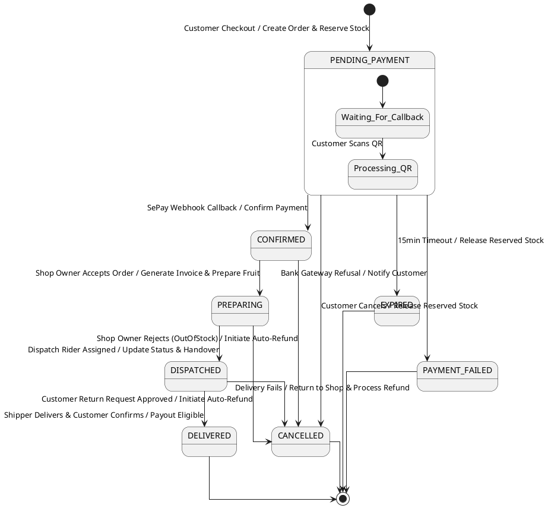

#### Detailed State Transition Matrix - Orders

| Current State | Event (Trigger) | Next State | Guard Conditions | Action / Database Updates |
| :--- | :--- | :--- | :--- | :--- |
| **None** | Customer clicks checkout in Cart screen | `PENDING_PAYMENT` | Stock available for all variants; delivery address within 20km. | **Insert** `orders` & `order_items`, **Call** `InventoryService.reserveStock()`, **Generate** VietQR QR code. |
| `PENDING_PAYMENT` | Webhook triggers dynamic QR callback | `CONFIRMED` | Signature is valid; paid amount matches order `final_amount` exactly. | **Update** `orders.status` ➔ `CONFIRMED`, **Call** `PaymentService.completeTransaction()`, **Alert** Shop Owner dashboard. |
| `PENDING_PAYMENT` | Customer clicks "Cancel Order" in panel | `CANCELLED` | Order has not yet been paid. | **Update** `orders.status` ➔ `CANCELLED`, **Call** `InventoryService.releaseStock()` to return items to warehouse. |
| `PENDING_PAYMENT` | 15-minute checkout countdown expires | `EXPIRED` | Payment callback has not been received. | **Update** `orders.status` ➔ `EXPIRED`, **Call** `InventoryService.releaseStock()` automatically via background scheduler. |
| `CONFIRMED` | Shop Owner clicks "Reject Order" | `CANCELLED` | Order was already paid. | **Update** `orders.status` ➔ `CANCELLED`, **Insert** record into `return_requests` (type `CANCEL`), **Trigger** automated bank refund. |
| `CONFIRMED` | Shop Owner clicks "Accept & Prepare" | `PREPARING` | Stock variants are verified manually. | **Update** `orders.status` ➔ `PREPARING`, **Log** audit metrics in `inventory_logs`. |
| `PREPARING` | Shipper scans QR or accepts dispatch | `DISPATCHED` | Shipper ID is validated and assigned. | **Update** `orders.status` ➔ `DISPATCHED`, **Insert** `deliveries` record, **Push** SMS notification to Customer. |
| `DISPATCHED` | Shipper uploads proof or customer signs OTP | `DELIVERED` | Order status is active. | **Update** `orders.status` ➔ `DELIVERED`, **Update** `deliveries.status` ➔ `DELIVERED`, **Unlock** billing settlement. |

---

### 2.2 Logistics Delivery Lifecycle State Chart (`deliveries.status`)

Tracks shipper assignments, pick-ups, route tracking, and success/failure resolutions.

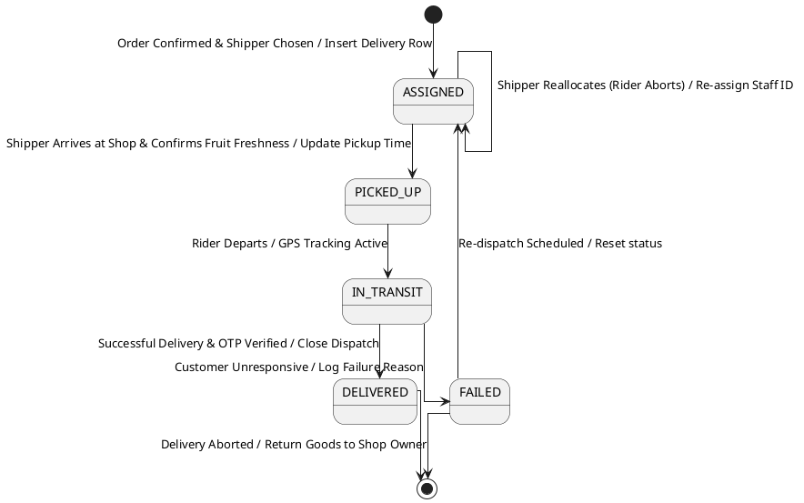

#### Detailed State Transition Matrix - Deliveries

| Current State | Event (Trigger) | Next State | Guard Conditions | Action / Database Updates |
| :--- | :--- | :--- | :--- | :--- |
| **None** | Order enters `PREPARING` status | `ASSIGNED` | Driver is within range and has no active orders. | **Insert** `deliveries` row with driver `staff_id`, **Push** alert to driver mobile application. |
| `ASSIGNED` | Driver arrives at pickup hub and clicks "Confirm" | `PICKED_UP` | Driver has arrived at pickup address. | **Update** `deliveries.status` ➔ `PICKED_UP`, **Set** `picked_up_at` timestamp. |
| `PICKED_UP` | Driver clicks "Start Route" on mobile app | `IN_TRANSIT` | Package barcode is scanned. | **Update** `deliveries.status` ➔ `IN_TRANSIT`, **Enable** dynamic client tracking. |
| `IN_TRANSIT` | Customer signs OTP / photo uploaded | `DELIVERED` | OTP matches. | **Update** `deliveries.status` ➔ `DELIVERED`, **Set** `delivered_at` timestamp, **Update** `orders.status` ➔ `DELIVERED`. |
| `IN_TRANSIT` | Driver reports customer unresponsive after 3 attempts | `FAILED` | Call logs verify attempts were made. | **Update** `deliveries.status` ➔ `FAILED`, **Set** `failure_reason` to "Unresponsive Phone". |

---

### 2.3 Payment Escrow Transaction Lifecycle (`payment_transactions.status`)

Manages digital escrow QR codes, bank transfer matches, and refund reversals.

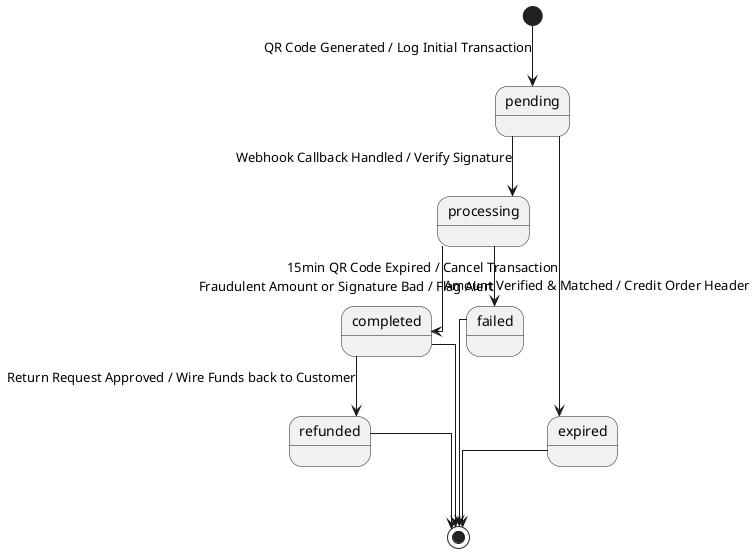

#### Detailed State Transition Matrix - Payments

| Current State | Event (Trigger) | Next State | Guard Conditions | Action / Database Updates |
| :--- | :--- | :--- | :--- | :--- |
| **None** | Customer clicks "Pay Now" | `pending` | Cart order is successfully reserved. | **Insert** `payment_transactions` record, **Generate** dynamic SePay payment reference memo. |
| `pending` | Webhook triggered by bank | `processing` | Callback signature is valid. | **Verify** payload signature, **Check** idempotency table `sepay_webhook_dedup`. |
| `processing` | Amount matches and signature matches | `completed` | Paid amount matches order exactly. | **Update** `payment_transactions.status` ➔ `completed`, **Update** `orders.status` ➔ `CONFIRMED`. |
| `processing` | Verification fails (wrong amount/bad signature) | `failed` | Signature or amount is mismatching. | **Update** `payment_transactions.status` ➔ `failed`, **Insert** raw callback response into `provider_response` for audit. |
| `completed` | Return request approved by Shop Owner | `refunded` | Order is within 48-hour return window. | **Update** `payment_transactions.status` ➔ `refunded`, **Trigger** SePay dynamic refund API request. |

---

### 2.4 Return & Refund Lifecycle State Chart (`return_requests.status`)

Tracks cancellation, exchange, and refund requests submitted by customers for damaged or rotten fruit.

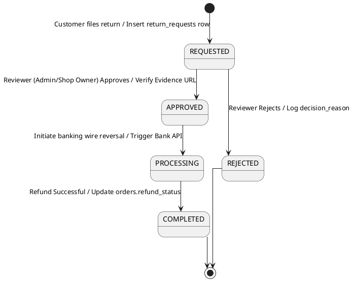

#### Detailed State Transition Matrix - Return Requests

| Current State | Event (Trigger) | Next State | Guard Conditions | Action / Database Updates |
| :--- | :--- | :--- | :--- | :--- |
| **None** | Customer clicks "File Return" and uploads proof | `REQUESTED` | Order status is `DELIVERED`; request is within 48 hours. | **Insert** `return_requests` row, **Set** `status` to `REQUESTED`, **Save** `evidence_url` link. |
| `REQUESTED` | Shop Owner clicks "Approve Refund" | `APPROVED` | Evidence clearly shows damaged fruit. | **Update** `return_requests.status` ➔ `APPROVED`, **Set** `decided_by` to Shop Owner ID, **Set** `resolution_type` to `REFUND`. |
| `REQUESTED` | Shop Owner clicks "Reject Return" | `REJECTED` | No valid evidence uploaded or period has expired. | **Update** `return_requests.status` ➔ `REJECTED`, **Set** `decision_reason` to explain the refusal. |
| `APPROVED` | System triggers auto-refund payout API | `PROCESSING` | Payment gateway is online. | **Update** `return_requests.status` ➔ `PROCESSING`, **Call** `PaymentService.refundOrder()`. |
| `PROCESSING` | Payout confirmed by callback | `COMPLETED` | Funds successfully wired. | **Update** `return_requests.status` ➔ `COMPLETED`, **Update** `orders.refund_status` ➔ `REFUNDED`. |

---

### 2.5 Shop Payout Settlement Lifecycle State Chart (`shop_settlements.status`)

Coordinates the periodic billing settlement ledger accumulating completed orders and paying out Shop Owners.

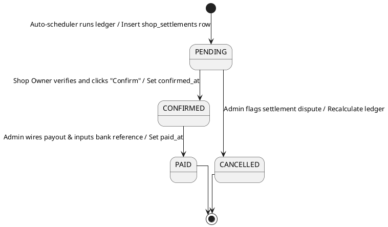

#### Detailed State Transition Matrix - Shop Settlements

| Current State | Event (Trigger) | Next State | Guard Conditions | Action / Database Updates |
| :--- | :--- | :--- | :--- | :--- |
| **None** | Weekly settlement cron job triggers | `PENDING` | Unsettled completed orders exist. | **Insert** `shop_settlements` and `shop_settlement_orders` mapping entries. |
| `PENDING` | Shop Owner clicks "Agree & Confirm" | `CONFIRMED` | Settlement amounts match Shop Owner records. | **Update** `shop_settlements.status` ➔ `CONFIRMED`, **Set** `confirmed_at` timestamp. |
| `PENDING` | Shop Owner files accounting dispute | `CANCELLED` | Disputed amounts exist. | **Update** `shop_settlements.status` ➔ `CANCELLED`, **Update** `orders.settlement_status` back to `UNSETTLED`. |
| `CONFIRMED` | Admin executes wire transfer and inputs TX reference | `PAID` | Payout was executed. | **Update** `shop_settlements.status` ➔ `PAID`, **Set** `paid_at` timestamp. |

---

## 3. Detailed Design of Core Features

This section details the static class designs and dynamic execution traces for three critical subsystems of the platform.

### 3.1 Feature 1: Secure Authentication & Role-Based Filtering

Protects client-side routes, manages persisted user login sessions, and enforces role authorization across `CUSTOMER`, `SHOP_OWNER`, `DELIVERY`, and `ADMIN` boundaries.

#### 3.1.1 Class Diagram - Security Subsystem

The structural design of the security subsystem consists of modular filter chains intercepting user actions, a cryptographically secure service layer, persistent session cookies, and database user accounts:

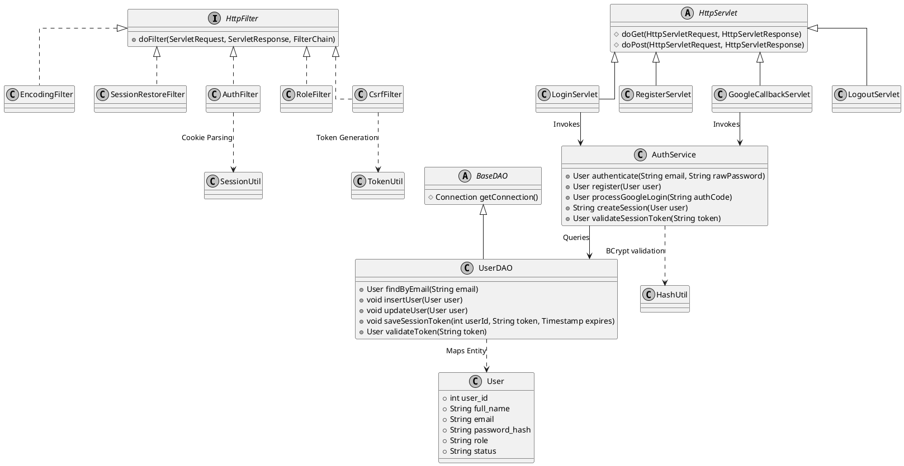

##### Component Responsibility Reference

| No | Component / Class | Responsibility Description |
|---|---|---|
| 01 | `com.fruitmkt.filter.EncodingFilter` | Global interceptor enforcing UTF-8 character encoding on all requests and responses. |
| 02 | `com.fruitmkt.filter.SessionRestoreFilter` | Restores active sessions using persistent HTTP-only cookies if the browser session expires. |
| 03 | `com.fruitmkt.filter.AuthFilter` | Blocks unauthorized route requests by verifying session states against the protected path hierarchy. |
| 04 | `com.fruitmkt.filter.RoleFilter` | Validates role authorization (e.g. blocking Shop Owners from accessing Customer checkout screens). |
| 05 | `com.fruitmkt.filter.CsrfFilter` | Protects mutable actions against Cross-Site Request Forgery by checking hidden form tokens. |
| 06 | `com.fruitmkt.servlet.auth.LoginServlet` | Handles customer/merchant manual email-password login submissions. |
| 07 | `com.fruitmkt.servlet.auth.GoogleCallbackServlet` | Integrates with Google OAuth 2.0 API to exchange authorization codes for profile data. |
| 08 | `com.fruitmkt.service.AuthService` | Executes core business checks: validates email verification status, checks account lock status, and calls BCrypt helpers. |
| 09 | `com.fruitmkt.dao.UserDAO` | Encapsulates all SQL statements on the `users` and `user_sessions` tables. |
| 10 | `com.fruitmkt.util.HashUtil` | Implements BCrypt password hashing logic (`BCrypt.hashpw()`, `BCrypt.checkpw()`). |

---

#### 3.1.2 Sequence Diagram - Secure Authentication & Role Filtering

This sequence trace illustrates the end-to-end flow of a user logging in manually and trying to access the protected shop owner dashboard:

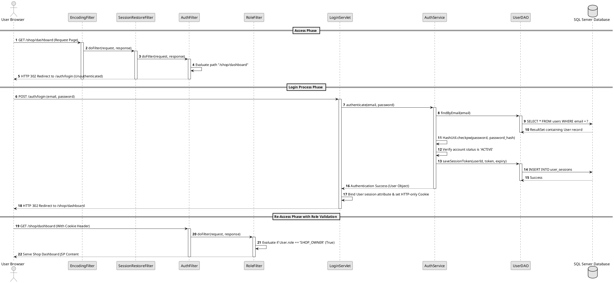

##### Detailed Sequence Flow Description

1. **Route Interception (Steps 1-6)**: The browser attempts to access `/shop/dashboard` without a session. The request is processed by the filter chain: `EncodingFilter` sets character sets, `SessionRestoreFilter` checks for persistent cookies, and `AuthFilter` intercepts the request since the user is unauthenticated, redirecting them to `/auth/login`.
2. **Credential Submission (Steps 7-8)**: The user submits their email and password. `LoginServlet` parses inputs and calls `AuthService.authenticate()`.
3. **Database Evaluation (Steps 9-11)**: `UserDAO` executes a query against `users`. If a record matches, `AuthService` extracts the secure BCrypt hash and executes `HashUtil.checkpw()` to verify the password.
4. **Session Persisting (Steps 12-14)**: The system confirms the account status is `ACTIVE` and inserts a new session token into `user_sessions` with a 30-day expiration window.
5. **Session Binding & Redirect (Steps 15-17)**: `LoginServlet` binds the user object to the current HTTPSession, sets an HTTP-only persistent cookie in the client browser, and issues an HTTP 302 redirect.
6. **Role Validation Guard (Steps 18-22)**: The browser re-requests the dashboard, providing the cookie. `AuthFilter` confirms authentication and forwards the request to `RoleFilter`. The filter evaluates the user role against required access levels and serves the dashboard content.

---

### 3.2 Feature 2: Multi-Shop Cart, Inventory Control & Split-Checkout

Enables customers to add products to their shopping carts, performs real-time stock availability validations, splits purchases into multiple orders grouped by Shop Owner, and reserves stock inside unified transactions.

#### 3.2.1 Class Diagram - Checkout Subsystem

The structural design of the checkout subsystem features clean MVC servlets, unified services handling transaction boundaries, specialized stock delta DAOs, and data transfer mappings:

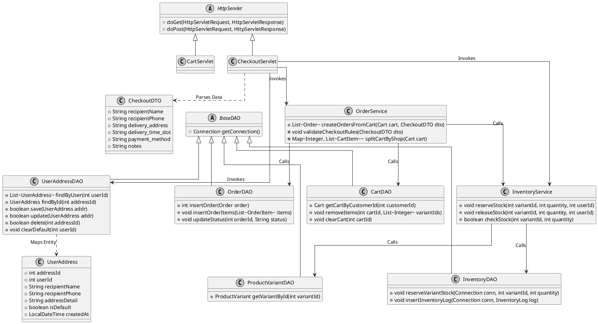

##### Component Responsibility Reference

| No | Component / Class | Responsibility Description |
|---|---|---|
| 01 | `com.fruitmkt.servlet.customer.CartServlet` | Manages customer cart operations (add item, update quantities, remove items). |
| 02 | `com.fruitmkt.servlet.customer.CheckoutServlet` | Intercepts checkout actions, validates form payloads, and renders payment options. |
| 03 | `com.fruitmkt.service.OrderService` | Orchestrates parent-child order calculations: splits carts by shop owner and handles transaction commits/rollbacks. |
| 04 | `com.fruitmkt.service.InventoryService` | Enforces real-time stock safety: reserves variant stocks and releases holds if transactions fail. |
| 05 | `com.fruitmkt.dao.OrderDAO` | Handles database insertions for the `orders` and `order_items` tables. |
| 06 | `com.fruitmkt.dao.CartDAO` | Retrieves active carts and removes checked-out items. |
| 08 | `com.fruitmkt.dao.ProductVariantDAO` | Retrieves product variants, pricing tiers, and stock amounts. |
| 09 | `com.fruitmkt.model.dto.CheckoutDTO` | A unified DTO mapping address information, logistics slots, and payment channels. |
| 10 | `com.fruitmkt.dao.UserAddressDAO` | Manages relational CRUD database operations for the `user_addresses` table. |
| 11 | `com.fruitmkt.model.entity.UserAddress` | Model entity representing a customer's registered shipping address. |

---

#### 3.2.2 Sequence Diagram - Split-Checkout & Stock Reservation

This sequence trace illustrates the process of checking out a cart containing fresh fruit from two different Shop Owners, reserving physical warehouse stock, and mapping separate child orders:

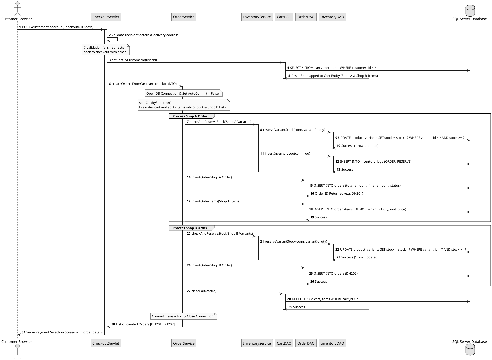

##### Detailed Sequence Flow Description

1. **Retrieving Cart States (Steps 1-4)**: The customer initiates checkout. `CheckoutServlet` calls `CartDAO.getCartByCustomerId()` to load the cart items. In this scenario, the cart contains items from **Shop A** and **Shop B**.
2. **Opening Transaction Limits (Steps 5-6)**: `OrderService` begins `createOrdersFromCart()`. It obtains a database connection and sets `Connection.setAutoCommit(false)` to open a secure database transaction boundary.
3. **Cart Splitting Algorithm (Step 7)**: The service maps cart items by `owner_id`. It groups them into distinct lists: Shop A list and Shop B list.
4. **Reserving Warehouse Inventory (Steps 8-13)**: The service loops through each shop's items. For Shop A, it calls `InventoryService.reserveVariantStock()`. The DAO executes a pessimistic lock query (`UPDATE product_variants SET stock = stock - ? WHERE variant_id = ? AND stock >= ?`). If the update fails (i.e. due to insufficient stock), the transaction rolls back, releasing database locks.
5. **Persisting Orders (Steps 14-19)**: The system writes the parent/child order headers and items for Shop A in the `orders` and `order_items` tables, returning the auto-incremented primary keys.
6. **Processing Shop B (Steps 20-25)**: The exact same transactional stock check and insert loop is executed for Shop B.
7. **Clearing Cart and Committing (Steps 26-29)**: Once all shop splits are successfully persisted, `CartDAO.clearCart()` removes the items from the customer's cart. The service executes `Connection.commit()` to finalize changes and release all database table locks.

---

### 3.3 Feature 3: Idempotent Webhook Escrow Payment & Automated Shop Payout Settlement

Receives automated payment notifications from bank webhook integrations (SePay VietQR), protects processing systems against duplicate callback attempts using idempotent ledger constraints, and coordinates merchant settlement records.

#### 3.3.1 Class Diagram - Payment & Payout Subsystem

The structural design of the payment and payout subsystem consists of webhook endpoints, signature hashing engines, idempotency ledger locks, and weekly payout compilers:

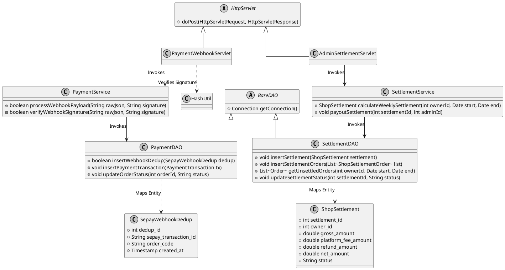

##### Component Responsibility Reference

| No | Component / Class | Responsibility Description |
|---|---|---|
| 01 | `com.fruitmkt.servlet.api.PaymentWebhookServlet` | Webhook API entry point. Validates callback headers and parses JSON structures. |
| 02 | `com.fruitmkt.servlet.admin.AdminSettlementServlet` | Serves as the control dashboard where system administrators process weekly payouts. |
| 03 | `com.fruitmkt.service.PaymentService` | Reconciles bank transfers: verifies callback payloads and logs transactional operations. |
| 04 | `com.fruitmkt.service.SettlementService` | Calculates platform commissions, subtracts refund totals, and computes net payout sums for shop owners. |
| 05 | `com.fruitmkt.dao.PaymentDAO` | Manages relational operations on the `payment_transactions` and `sepay_webhook_dedup` tables. |
| 06 | `com.fruitmkt.dao.SettlementDAO` | Compiles weekly order lists and inserts settlement headers and logs. |
| 07 | `com.fruitmkt.model.entity.SepayWebhookDedup` | Entity model serving as a unique ledger lock to enforce callback idempotency. |
| 08 | `com.fruitmkt.model.entity.ShopSettlement` | Entity model representing a merchant billing settlement session. |

---

#### 3.3.2 Sequence Diagram - Idempotent Payment & Settlement Flow

This sequence trace illustrates a bank callback reaching the platform, the execution of signature validations, the database idempotency uniqueness check, order updates, and the automated weekly billing settlement calculation:

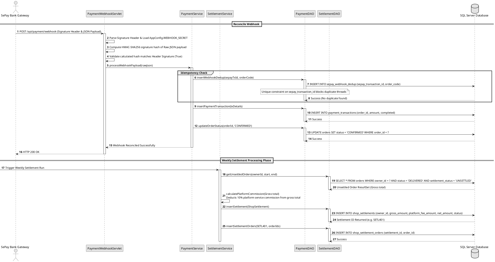

##### Detailed Sequence Flow Description

1. **Bank Webhook Arrival (Steps 1-4)**: The customer completes their bank transfer. SePay dispatches an HTTP POST request containing payment metadata to `PaymentWebhookServlet`. The servlet loads the signature secret, computes an HMAC-SHA256 checksum of the request body, and verifies it against the header signature.
2. **Idempotency Guard Execution (Steps 5-7)**: `PaymentWebhookServlet` calls `PaymentService.processWebhookPayload()`. The service makes an insertion attempt into `sepay_webhook_dedup` through `PaymentDAO`. The database enforces a `UNIQUE` index constraint on the callback ID. If a duplicate webhook (e.g. from network retries) attempts to write, the SQL Server throws a unique key violation, prompting the service to discard the duplicate request instantly.
3. **Persisting Payment Traces (Steps 8-10)**: The service writes a payment log in `payment_transactions` mapping the paid amount to the parent order ID, closing transaction checks.
4. **Order State Confirmation (Steps 11-13)**: The service sets the status in `orders` to `CONFIRMED`, making it visible to the Shop Owner's dashboard. A return value of `HTTP 200 OK` is sent back to the SePay bank gateway.
5. **Weekly Payout Compilation (Steps 14-16)**: The settlement scheduler runs weekly. `SettlementService` queries the database via `SettlementDAO` to select all completed (`DELIVERED`) and unsettled orders for the merchant.
6. **Platform Fee Deductions (Step 17)**: The service calculates total sales, subtracts any customer refunds within the accounting period, and deducts the platform's 10% commission fee.
7. **Persisting the Settlement Ledger (Steps 18-21)**: The service inserts a new payout record into `shop_settlements` in a `PENDING` state and updates the settlement status of all processed order headers to map them to the settlement ID.
