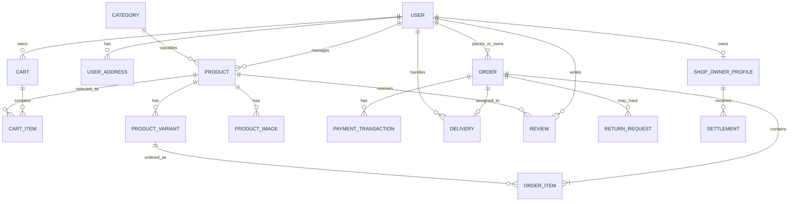

# 1. Introduction

## 1.1 Purpose

This SRS describes the functional and non-functional requirements for software release 1.0 of the **Online Fruit Shopping System**. The document is intended for project managers, developers, database designers, UI designers, testers, administrators, and representative system users. Unless otherwise noted, all requirements specified in this document are committed for Release 1.0.

## 1.2 Document Conventions

No special typographical conventions are used in this SRS.

## 1.3 Project Scope and Product Features

The **Online Fruit Shopping System** is a web-based application that allows customers to browse fruit products, manage shopping carts, place orders, make online payments, track deliveries, request returns or refunds, and review purchased products. Shop owners can register and manage shops, products, variants, images, inventory, promotions, and orders. Delivery staff can view assigned orders and update delivery statuses. Administrators can manage users, categories, shops, products, orders, payments, returns, settlements, and system activities. The system is implemented using Java 17, Jakarta Servlet 6, JSP, JSTL, Apache Tomcat 10, Apache Ant, and Microsoft SQL Server.

## 1.4 References

1. *SRS Core Requirements – FruitShop*, Version 0.1, internal project document, `docs/SRS_Full/SRS_Core_Requirements_FruitShop.md`.
2. *Functional Requirements – Online Fruit Shop System*, Version 0.1, internal project document, `docs/SRS_Full/SRS_Section_3_Functional_Requirements_FruitShop.docx.md`.
3. *Detailed Design Specification*, internal project document, `docs/SRS_Full/SRS_Detailed_Design_Specification.md`.
4. *Database Specification – Online Fruit Shopping Platform*, internal project document, `docs/SRS_Full/SRS_Database_Specification.md`.
5. *Schema.sql* and *Setup_OnlineFruitShopping.sql*, project database scripts, `database/`.
6. Jakarta Servlet Specification, [https://jakarta.ee/specifications/servlet/](https://jakarta.ee/specifications/servlet/).
7. Apache Tomcat 10 Documentation, [https://tomcat.apache.org/tomcat-10.0-doc/](https://tomcat.apache.org/tomcat-10.0-doc/).

# 2. Overall Description

## 2.1 Product Perspective

The Online Fruit Shopping System is a new web-based application for selling and purchasing fruit products online. It replaces manual product browsing, order recording, payment confirmation, and delivery tracking processes with a centralized system. The system includes interfaces for customers, shop owners, delivery staff, and administrators, and stores operational data in a Microsoft SQL Server database. Release 1.0 is designed as an independent application but may be extended in future releases with additional payment, delivery, and reporting services.

## 2.2 User Classes and Characteristics

**Customer (favored)**  
A Customer browses fruit products, manages a cart, places orders, makes payments, tracks deliveries, requests returns or refunds, and reviews purchased products. Customers are expected to use the system through a standard web browser and should not require specialized technical training.

**Shop Owner**  
A Shop Owner manages an approved shop, including products, variants, prices, images, inventory, promotions, and customer orders. Shop Owners require basic training in product, order, and inventory management.

**Delivery Staff**  
Delivery Staff view assigned orders, access delivery information, and update the delivery status. Their use of the system is limited to delivery-related functions.

**Administrator**  
An Administrator manages users, shops, categories, products, orders, payments, returns, settlements, and system monitoring. Administrators require the highest level of authorization and operational knowledge.

## 2.3 Operating Environment

**OE-1:** The system shall operate on a server that supports Java 17 and Apache Tomcat 10.

**OE-2:** The system shall use Microsoft SQL Server for persistent storage of users, products, inventory, carts, orders, payments, deliveries, reviews, and settlements.

**OE-3:** Users shall access the system through a modern web browser on a desktop computer, laptop, tablet, or smartphone.

**OE-4:** The web application, application server, and database shall operate within the project development or deployment environment configured by the project team.

## 2.4 Design and Implementation Constraints

**CO-1:** The system shall be implemented using Java 17, Jakarta Servlet 6, JSP, JSTL, Apache Tomcat 10, and Apache Ant.

**CO-2:** The system shall follow the layered architecture of Servlet/Controller, Service, DAO, and Database.

**CO-3:** SQL statements shall be implemented in DAO classes using prepared statements and resource-safe database access.

**CO-4:** JSP pages shall be stored behind `WEB-INF` and POST operations shall preserve the Post/Redirect/Get pattern where applicable.

**CO-5:** The system shall enforce role-based access for Customers, Shop Owners, Delivery Staff, and Administrators.

## 2.5 Assumptions and Dependencies

**AS-1:** Users have access to a supported web browser and a reliable network connection.

**AS-2:** Shop Owners provide accurate product, price, stock, and shop information.

**AS-3:** Delivery Staff update delivery statuses accurately after receiving and processing assigned orders.

**AS-4:** The Microsoft SQL Server database is available and configured before the application is started.

**DE-1:** Online payment confirmation depends on the availability and correct configuration of the VietQR/SePay payment service or its configured webhook interface.

**DE-2:** Application operation depends on the availability of the Java runtime, Apache Tomcat server, and Microsoft SQL Server database.

**DE-3:** Email verification and password-recovery functions depend on the availability of the configured email service.

# 3. System Features

## 3.1 System Models

### 3.1.1 Use-Case Diagram

The use-case diagram shall show the relationships between the main actors and the Online Fruit Shopping System. The main actors are Guest, Customer, Shop Owner, Delivery Staff, Administrator, Payment Gateway/Bank, and Scheduler/Timer.

**Figure 1. Use-case diagram for the Online Fruit Shopping System.**  
*Insert the approved use-case diagram here.*

### 3.1.2 System Feature Tree

The system feature tree is organized into the following major feature groups:

```text
Online Fruit Shopping System
├── User Management
├── Product Discovery
├── Product Management
├── Shopping Cart and Wishlist
├── Order Management
├── Payment Management
├── Delivery Management
├── Promotion Management
├── Review and Rating Management
├── Notification Management
└── Administration, Reporting, and Settlement
```

**Figure 2. System feature tree.**  
*Insert the detailed feature tree from `docs/Modules_Features/SRS_Feature_Tree_FruitShop.md` here.*

### 3.1.3 Context Diagram

The context diagram shall show the Online Fruit Shopping System as a single system process and the external entities that exchange data with it: Guest, Customer, Shop Owner, Delivery Staff, Administrator, Payment Gateway/Bank, and Scheduler/Timer.

**Figure 3. Context diagram for Release 1.0.**  
*Insert the approved context diagram here.*

## 3.2 System Feature: Manage Account

### 3.2.1 Description

The Manage Account feature allows a user to create an account, sign in, sign out, verify an email address, view and update profile information, manage delivery addresses, change a password, and recover access to the account. The feature applies to Customers, Shop Owners, Delivery Staff, and Administrators. A Guest may create an account or sign in before using functions that require authentication.

### 3.2.2 Stimulus/Response Sequences

| Stimulus | System response |
|---|---|
| The Guest opens the registration page. | The system displays the account registration form. |
| The user submits required registration information. | The system validates the input and checks whether the email or phone number is already registered. |
| The submitted information is invalid. | The system displays validation messages and asks the user to correct the relevant fields. |
| The email or phone number already exists. | The system rejects the registration and informs the user that the account information is already in use. |
| The registration information is valid and unique. | The system creates the account with the appropriate initial status and sends an email-verification message when required. |
| The user submits valid login credentials. | The system authenticates the user, creates a session, and redirects the user to the appropriate page according to the user's role. |
| The user submits invalid login credentials. | The system displays an error message and does not create an authenticated session. |
| The user exceeds the permitted number of failed login attempts. | The system temporarily locks the account and informs the user of the lockout condition. |
| The authenticated user requests to log out. | The system invalidates the session and redirects the user to the public entry page. |

### 3.2.3 Functional Requirements: Create New Account

**Account.Register:** Creating a new user account

**Account.Register.Display:** The system shall display fields for full name, email address, password, password confirmation, phone number, and account-related information required by the selected registration flow.

**Account.Register.Validate:** The system shall validate all required fields before creating the account. The system shall reject an empty, malformed, or invalid email address and shall reject a password that does not satisfy the configured password rules.

**Account.Register.Unique:** The system shall prevent registration when the submitted email address or phone number is already associated with an existing account.

**Account.Register.Password:** The system shall store the password as a secure hash and shall not store the original plain-text password.

**Account.Register.Status:** The system shall create a new account with the configured initial status and default customer role unless another role-selection flow explicitly applies.

**Account.Register.Verification:** When email verification is required, the system shall generate a verification process and inform the user that the account must be verified before protected functions can be used.

**Account.Register.Success:** After successful registration, the system shall display a confirmation message and provide the next permitted action, such as email verification or login.

**Account.Register.Failure:** If account creation fails, the system shall not create a partial account and shall display an appropriate error message.

### 3.2.4 Create New Account Screen

**Figure 4. Create New Account screen.**  
*Insert the approved GUI wireframe or screenshot of the Create New Account screen here.*

The screen should contain the following controls:

- Full Name
- Email Address
- Phone Number
- Password
- Confirm Password
- Register button
- Link to the Login screen

## 3.2.5 System Feature: Login Account

### Description

The Login Account feature allows a registered user to authenticate and access functions permitted by the user's role. The feature supports Customers, Shop Owners, Delivery Staff, and Administrators. The system shall validate the submitted credentials, enforce account status and login-lockout rules, create a secure authenticated session, and redirect the user to the appropriate landing page.

### Stimulus/Response Sequences

| Stimulus | System response |
|---|---|
| The Guest or registered user opens the Login screen. | The system displays fields for email address and password, together with Login, Create Account, and Forgot Password actions. |
| The user submits the login form with an empty field. | The system displays a validation message and does not send an authentication request. |
| The user submits an invalid email or password. | The system displays a generic authentication error and does not reveal which credential was incorrect. |
| The user submits valid credentials for an active account. | The system authenticates the user, creates a secure session, and redirects the user according to the user's role. |
| The account is unverified, locked, suspended, or inactive. | The system rejects login and displays the permitted next action without creating an authenticated session. |
| The user exceeds the failed-login limit. | The system records the failed attempt, applies the configured lockout policy, and informs the user that the account is temporarily locked. |
| The user selects Forgot Password. | The system redirects the user to the password-recovery flow without disclosing whether an account exists for the submitted email. |
| The authenticated user selects Logout. | The system invalidates the session and redirects the user to a public page. |

### Functional Requirements

**Account.Login.Display:** The system shall display the Login screen with fields for email address and password and links to Create Account and Forgot Password.

**Account.Login.Validate:** The system shall validate that the email address and password fields are present before attempting authentication.

**Account.Login.Authenticate:** The system shall verify the submitted credentials against the stored account data using the configured password-verification mechanism.

**Account.Login.GenericError:** If authentication fails, the system shall display a generic error message and shall not identify whether the email address or password was incorrect.

**Account.Login.Status:** The system shall prevent login for accounts that are locked, suspended, inactive, or otherwise not eligible for authentication.

**Account.Login.Verification:** If email verification is required and has not been completed, the system shall inform the user that verification is required and shall provide the permitted verification or resend action.

**Account.Login.Lockout:** The system shall count consecutive failed login attempts and shall temporarily lock the account when the configured failure threshold is reached.

**Account.Login.Session:** After successful authentication, the system shall create a secure session containing only the minimum information required for authorization and user context.

**Account.Login.RoleRedirect:** The system shall redirect the authenticated user to the appropriate page according to the assigned role: Customer, Shop Owner, Delivery Staff, or Administrator.

**Account.Login.Authorization:** Authentication shall not grant permissions beyond those defined for the user's role.

**Account.Login.Logout:** The system shall invalidate the authenticated session when the user logs out or when the configured session-expiration policy is reached.

**Account.Login.Security:** The system shall not expose passwords, password hashes, session tokens, lockout internals, or authentication secrets in the user interface or application logs.

### Login Account Screen

**Figure 5. Login Account screen.**  
*Insert the approved GUI wireframe or screenshot of the Login Account screen here.*

The screen should contain the following controls:

- Email Address
- Password
- Login button
- Remember-me option, if enabled by project policy
- Forgot Password link
- Create Account link

## 3.3 System Feature: Place and Manage Order

### 3.3.1 Description

A Customer with a valid shopping cart may place an order for products offered by one Shop Owner. The Customer shall provide a delivery address, review the selected products and quantities, choose an available payment method, and confirm the order. The system shall validate product availability, reserve the required inventory, record the order, and provide the Customer with the order status and confirmation information. Priority = High.

### 3.3.2 Stimulus/Response Sequences

| Stimulus | System response |
|---|---|
| The Customer opens the cart or checkout page. | The system displays the selected products, variants, quantities, prices, discounts, delivery fee, and estimated total. |
| The Customer changes a product quantity. | The system validates the requested quantity against current stock and recalculates the cart total. |
| The Customer requests more units than available. | The system rejects the quantity and displays the maximum available quantity. |
| The Customer removes a product from the cart. | The system removes the selected item and recalculates the cart summary. |
| The Customer selects or enters a delivery address. | The system validates the recipient name, phone number, and delivery address before continuing. |
| The Customer submits the checkout request. | The system verifies that the products are active, the variants are available, the prices are valid, and the cart belongs to the Customer. |
| The Customer selects a payment method. | The system displays the payment instructions and any information required for that payment method. |
| The Customer confirms the order. | The system reserves inventory, creates the order, creates the order items, and displays the order number and initial status. |
| Payment is confirmed successfully. | The system records the payment transaction, updates the payment status, and notifies the Customer and Shop Owner. |
| Payment fails or expires. | The system displays the payment failure or expiration message and keeps the order in the appropriate unpaid or cancelled state. |
| Inventory reservation or order creation fails. | The system rolls back the transaction, releases any reservation already created, and informs the Customer that the order was unsuccessful. |

### 3.3.3 Functional Requirements

**Order.Cart: Reviewing the shopping cart**

**.Display:** The system shall display each selected product, product variant, quantity, unit price, discount, subtotal, and current availability.

**.Quantity:** The system shall allow the Customer to increase or decrease the quantity of an item within the available stock limit.

**.Remove:** The system shall allow the Customer to remove an item from the cart before order confirmation.

**.Empty:** If the cart contains no items, the system shall inform the Customer that checkout cannot continue and shall provide a link to continue shopping.

**Order.Address: Selecting a delivery address**

**.Select:** The Customer shall select an existing delivery address or provide a new delivery address.

**.Validate:** The system shall validate the recipient name, phone number, and address detail before accepting the delivery address.

**.Required:** The system shall not allow an order to be confirmed without a valid delivery address unless a supported pickup option is explicitly provided.

**Order.Validate: Validating an order**

**.Product:** The system shall verify that every product and product variant in the cart is active and available for sale.

**.Price:** The system shall calculate the order total from the current product price, valid discount, quantity, promotion, and delivery fee.

**.Stock:** The system shall verify that the requested quantity does not exceed the available stock before creating the order.

**.Shop:** The system shall ensure that an order belongs to one Shop Owner only.

**Order.Confirm: Confirming an order**

**.Display:** The system shall display the order items, delivery address, payment method, delivery fee, discount amount, and final total before confirmation.

**.Prompt:** The system shall prompt the Customer to confirm, edit, or cancel the order.

**.Response:** The Customer shall be able to return to the cart, change the delivery information, change the payment method, or confirm the order.

**Order.Pay: Processing payment**

**.Method:** The system shall allow the Customer to select one of the payment methods configured for Release 1.0, including Cash on Delivery when enabled and VietQR/SePay online payment.

**.Online:** For online payment, the system shall create a payment transaction and display the payment instructions or dynamic QR information required by the configured payment service.

**.Webhook:** The system shall process a valid payment callback from the payment service and update the related transaction idempotently.

**.Failure:** If payment is rejected, invalid, duplicated, or expired, the system shall not mark the order as paid and shall display the applicable payment status to the Customer.

**Order.Done: Completing an order**

**.Reserve:** The system shall reserve the required inventory before finalizing the order.

**.Store:** The system shall assign a unique order number and store the order with the appropriate initial order and payment statuses.

**.Items:** The system shall store each selected product variant, quantity, unit price, discount, and subtotal as an order item.

**.Update:** The system shall update the relevant inventory records and create an inventory log for the reserved quantity.

**.Notify:** The system shall notify the Customer of the order result and notify the Shop Owner when a new order requires processing.

**.Failure:** If any required step fails, the system shall roll back the order transaction, release the inventory reservation, and inform the Customer that the order was unsuccessful.

**Order.Track: Tracking an order**

**.History:** The system shall allow the Customer to view order history and order details.

**.Status:** The system shall display the current order status, payment status, delivery information, and relevant status history.

**.Delivery:** The system shall display delivery updates when the Shop Owner or Delivery Staff changes the delivery status.

### 3.3.4 Order and Checkout Screens

**Figure 6. Shopping Cart and Checkout screens.**  
*Insert the approved GUI wireframes or screenshots for the Shopping Cart, Checkout, Payment, and Order Confirmation screens here.*

## 3.4 System Feature: Manage Shop Products and Inventory

This feature replaces **Order Meals from Restaurants** and **Create, View, Modify, and Delete Cafeteria Menus** from the cafeteria example. In the Online Fruit Shopping System, Shop Owners manage fruit products, product variants, images, prices, packaging options, and inventory. Administrators review products and manage product categories.

**Product.Create:** An authorized Shop Owner shall be able to create a product with its name, category, description, origin, images, variants, price, and initial stock information.

**Product.View:** The system shall display only active and approved products to Customers. Shop Owners shall be able to view products belonging to their own shop, while Administrators shall be able to view products across the system.

**Product.Modify:** An authorized Shop Owner shall be able to update product information, variants, prices, images, packaging options, and availability for products belonging to that shop.

**Product.Delete:** An authorized Shop Owner shall be able to remove or deactivate a product listing that is no longer offered, subject to the applicable order and data-retention rules.

**Product.Approve:** An Administrator shall be able to approve, reject, hide, or remove a product listing that does not satisfy the system rules. The system shall record the reason when a product is rejected or removed.

**Inventory.Update:** The system shall update available stock when an order is reserved, cancelled, delivered, returned, or otherwise changes inventory according to the business rules.

**Inventory.Alert:** The system shall notify the Shop Owner when the stock quantity reaches the configured low-stock threshold.

**Figure 7. Product and inventory management screens.**  
*Insert the approved GUI wireframes or screenshots for the Product List, Product Form, Variant Management, and Inventory Management screens here.*

## 3.5 System Feature: Manage Product Categories

This feature is the project-specific equivalent of **Create, View, Modify, and Delete Cafeteria Menus** at the catalog-management level. Administrators manage the categories used to organize fruit products in the storefront.

**Category.Create:** The Administrator shall be able to create a category with a unique name and slug.

**Category.View:** The system shall display active categories to Customers and authorized categories to Shop Owners when products are created or edited.

**Category.Modify:** The Administrator shall be able to update the name, slug, display order, and active status of a category.

**Category.Delete:** The Administrator shall be able to deactivate or remove a category only when doing so does not violate product references or the applicable data-retention rules.

**Category.Display:** The system shall allow Customers to browse products by an active category.

**Figure 8. Category management screen.**  
*Insert the approved GUI wireframe or screenshot for the Category Management screen here.*

## 3.6 Features Outside the Project Scope

The cafeteria example includes **Create, View, Modify, and Delete Meal Subscriptions**. The Online Fruit Shopping System does not provide recurring meal subscriptions in Release 1.0. Customers place individual fruit orders through the shopping cart and checkout process.

Meal subscriptions are therefore **out of scope for Release 1.0**. A subscription feature may be considered for a future release if the project requirements are expanded to support recurring orders, scheduled delivery, subscription pricing, and automatic payment.

# 4. Use-Case Specifications

## 4.1 Use Case UC-01: Create Account

| Item | Description |
|---|---|
| Use Case ID | UC-01 |
| Use Case Name | Create Account |
| Primary Actor | Guest |
| Supporting Actors | Email Service, Online Fruit Shopping System |
| Goal | To create a user account that can be used to access protected system functions. |
| Priority | High |
| Trigger | The Guest selects the Register or Create Account function. |
| Preconditions | The Guest is not authenticated and the registration service is available. |
| Postconditions | A valid account is created, or no account is created if validation or registration fails. |
| Related Requirements | Account.Register, Account.Register.Display, Account.Register.Validate, Account.Register.Unique, Account.Register.Password, Account.Register.Status, Account.Register.Verification, Account.Register.Success, Account.Register.Failure |

### Main Success Scenario

1. The Guest opens the Create Account screen.
2. The system displays the registration form.
3. The Guest enters the required information, including full name, email address, phone number, password, and password confirmation.
4. The Guest submits the registration form.
5. The system validates the required fields and the password confirmation.
6. The system checks that the email address and phone number are not already registered.
7. The system securely hashes the password.
8. The system creates the account with the default Customer role and the configured initial status.
9. If verification is required, the system sends an email-verification message.
10. The system displays a registration-success message and instructions for the next step.

### Alternate and Exception Flows

**A1. Invalid input**

1. At Step 5, the system detects missing or invalid information.
2. The system displays a validation message beside the relevant field.
3. The Guest corrects the information and resubmits the form.
4. The use case continues at Step 5 of the main success scenario.

**A2. Existing email or phone number**

1. At Step 6, the system detects that the email address or phone number is already registered.
2. The system rejects the registration and informs the Guest that the information is already in use.
3. The Guest enters different information or navigates to the Login or Forgot Password function.

**A3. Email delivery failure**

1. At Step 9, the email service cannot send the verification message.
2. The system does not expose sensitive technical details.
3. The system informs the Guest that registration requires verification and provides a retry option.

**A4. System or database failure**

1. At any step involving persistence, the system detects a failure.
2. The system rolls back the incomplete registration transaction.
3. The system displays an appropriate failure message.
4. No partial account shall remain in the database.

## 4.2 Use Case UC-03: Place and Manage Order

| Item | Description |
|---|---|
| Use Case ID | UC-03 |
| Use Case Name | Place and Manage Order |
| Primary Actor | Customer |
| Supporting Actors | Shop Owner, Delivery Staff, Payment Gateway/Bank, Scheduler/Timer |
| Goal | To create and monitor an order for available fruit products. |
| Priority | High |
| Trigger | The Customer selects Checkout from a non-empty shopping cart. |
| Preconditions | The Customer is authenticated, the cart contains at least one item, and the selected products are available for sale. |
| Postconditions | A valid order is stored with its items, delivery information, payment status, and initial order status; or the transaction is rolled back if the order cannot be created. |
| Related Requirements | Order.Cart, Order.Address, Order.Validate, Order.Confirm, Order.Pay, Order.Done, Order.Track |

### Main Success Scenario

1. The Customer opens the shopping cart.
2. The system displays the selected products, variants, quantities, prices, discounts, delivery fee, and estimated total.
3. The Customer reviews the cart and selects Checkout.
4. The system validates the product status, product prices, requested quantities, and current inventory.
5. The Customer selects an existing delivery address or enters a new valid delivery address.
6. The Customer selects an available payment method.
7. The system displays the complete order summary for confirmation.
8. The Customer confirms the order.
9. The system reserves the required inventory.
10. The system creates the order and order items in a single transaction.
11. The system assigns a unique order number and stores the appropriate initial order and payment statuses.
12. If online payment is selected, the system creates the payment transaction and displays the payment instructions or QR code.
13. The payment service confirms successful payment, or the system records the selected alternative payment status.
14. The system notifies the Customer and Shop Owner.
15. The system displays the order confirmation and allows the Customer to view order tracking.

### Alternate and Exception Flows

**A1. Cart is empty**

1. At Step 1, the system detects that the cart contains no items.
2. The system prevents checkout and displays a message directing the Customer to continue shopping.

**A2. Product or inventory is unavailable**

1. At Step 4, the system detects that a product is inactive, a variant is unavailable, or the requested quantity exceeds stock.
2. The system identifies the affected item and displays the maximum available quantity or the reason it cannot be ordered.
3. The Customer updates or removes the item before retrying checkout.

**A3. Invalid delivery address**

1. At Step 5, the system detects incomplete or invalid recipient information.
2. The system displays validation messages.
3. The Customer corrects the address and continues checkout.

**A4. Payment failure or expiration**

1. At Step 13, the payment service rejects or does not confirm the payment within the permitted period.
2. The system records the payment failure or expiration.
3. The system does not mark the order as paid.
4. The Customer may retry payment, select another available payment method, or cancel the order according to the order status rules.

**A5. Duplicate payment callback**

1. The payment service sends a callback that has already been processed.
2. The system identifies the duplicate transaction or callback.
3. The system does not create a second payment record or update the order twice.

**A6. Order transaction failure**

1. At Steps 9–11, the system detects a reservation, database, or transaction failure.
2. The system rolls back the order and order-item changes.
3. The system releases any inventory reservation created during the attempt.
4. The system informs the Customer that the order was unsuccessful.

**A7. Customer views order status**

1. After Step 15, the Customer opens Order History or Order Detail.
2. The system displays the order status, payment status, delivery address, order items, total amount, and available tracking information.

### Business Rules

- One order shall belong to one Shop Owner.
- Inventory shall be checked and reserved before the order is finalized.
- The order total shall be calculated from the current valid price, quantity, promotion, and delivery fee.
- A payment callback shall be processed idempotently.
- An order shall not be marked as paid unless a valid payment result is received or an approved alternative payment rule applies.
- Every order status transition shall follow the permitted order workflow.

## 4.3 Formal Use-Case Form: UC-01 Create New Account

| Field | Specification |
|---|---|
| UC ID and Name | **UC-01 – Create New Account** |
| Created By | Project Team |
| Date Created | 19 July 2026 |
| Primary Actor | Guest |
| Secondary Actors | Email Service; Online Fruit Shopping System |
| Trigger | The Guest selects **Register** or **Create Account**. |
| Description | This use case allows a Guest to create an account for accessing authenticated functions of the Online Fruit Shopping System. |
| Preconditions | The Guest is not authenticated; the registration page is available; the submitted email address and phone number are not already registered. |
| Postconditions | A new account is created and stored in the database with the default `CUSTOMER` role and the configured initial status. If verification is required, a verification request is created. |
| Priority | High |
| Frequency of Use | Occasional; performed whenever a new user joins the system. |
| Business Rules | The email address must be valid and unique. The phone number must satisfy the configured format and uniqueness rule. Passwords must be stored as secure hashes. A newly registered account must not receive privileges beyond its assigned role. |
| Other Information | The screen shall provide links to Login and Forgot Password. Customer-facing messages shall support UTF-8. |
| Assumptions | The Guest provides accurate registration information and the configured email service is available when verification is required. |

### UC-01 Normal Flow

| Step | Actor Action | System Response |
|---:|---|---|
| 1 | The Guest opens the Create New Account screen. | The system displays the registration form. |
| 2 | The Guest enters full name, email, phone number, password, and password confirmation. | The system accepts the entered information. |
| 3 | The Guest selects **Register**. | The system validates all required fields and password rules. |
| 4 | — | The system checks whether the email address or phone number already exists. |
| 5 | — | The system securely hashes the password and creates the account with the default `CUSTOMER` role. |
| 6 | — | If required, the system sends an email-verification message. |
| 7 | — | The system displays a successful-registration message and instructions for verification or login. |

### UC-01 Alternative Flows

| ID | Condition and Flow |
|---|---|
| A1 | **Invalid input:** The system displays field-level validation messages. The Guest corrects the information and resubmits the form from Step 3. |
| A2 | **Existing email or phone:** The system informs the Guest that the information is already in use and provides an option to enter different information or navigate to Login/Forgot Password. |
| A3 | **Verification resend:** If the Guest does not receive the verification message, the Guest requests a resend. The system validates the request and sends a new verification message subject to the resend policy. |

### UC-01 Exceptions

| ID | Exception and System Behavior |
|---|---|
| E1 | **Database failure:** The system rolls back the registration transaction, does not retain a partial account, and displays a general failure message. |
| E2 | **Email service failure:** The system records the appropriate verification state, does not expose technical details, and displays a retry message. |
| E3 | **Session or security failure:** The system rejects the request and requires the Guest to restart the registration flow. |

## 4.4 Formal Use-Case Form: UC-02 Login Account

| Field | Specification |
|---|---|
| UC ID and Name | **UC-02 – Login Account** |
| Created By | Project Team |
| Date Created | 20 July 2026 |
| Primary Actor | Guest or registered user |
| Secondary Actors | Authentication Service; Online Fruit Shopping System |
| Trigger | The user selects **Login** and submits an email address and password. |
| Description | This use case authenticates a registered user and creates a secure session for accessing authorized system functions. |
| Preconditions | The Login screen is available; the user has a registered account; the authentication and database services are available. |
| Postconditions | For success, an authenticated session is created and the user is redirected according to the user's role. For failure, no authenticated session is created. |
| Priority | High |
| Frequency of Use | Frequent; performed whenever a user accesses a protected function without a valid session. |
| Business Rules | Credentials must be verified against the stored password hash. Locked, suspended, inactive, or unverified accounts shall not be authenticated when verification is required. Failed attempts shall follow the configured lockout policy. |
| Other Information | The Login screen provides Forgot Password and Create Account links. Authentication errors shall use generic wording and shall not disclose sensitive account information. |
| Assumptions | The user remembers the registered email address and password, and the configured authentication service and database are available. |

### UC-02 Normal Flow

| Step | Actor Action | System Response |
|---:|---|---|
| 1 | The user opens the Login screen. | The system displays the email address and password fields. |
| 2 | The user enters a registered email address and password. | The system accepts the submitted credentials. |
| 3 | The user selects **Login**. | The system validates the required fields and verifies the credentials against the stored password hash. |
| 4 | — | The system checks the account status, verification state, and lockout state. |
| 5 | — | The system creates a secure authenticated session containing the required user and role context. |
| 6 | — | The system redirects the user to the appropriate landing page according to the assigned role. |

### UC-02 Alternative Flows

| ID | Condition and Flow |
|---|---|
| A1 | **Missing field:** The system displays a validation message for the missing email address or password. The user corrects the form and resubmits it from Step 3. |
| A2 | **Email verification required:** The system informs the user that the account must be verified and provides the permitted verification or resend action. |
| A3 | **Forgot password:** The user selects Forgot Password. The system starts the password-recovery flow without revealing whether the email exists. |
| A4 | **Role-specific redirect:** After successful login, the system redirects the user to the Customer, Shop Owner, Delivery Staff, or Administrator landing page according to the stored role. |
| A5 | **Session expiration:** When the session expires, the system redirects the user to Login and displays a session-expired message without losing unrelated public data. |

### UC-02 Exceptions

| ID | Exception and System Behavior |
|---|---|
| E1 | **Invalid credentials:** The system displays a generic authentication error, records the failed attempt, and does not create a session. |
| E2 | **Account locked:** The system rejects login and displays the permitted lockout message and recovery instruction. |
| E3 | **Account suspended or inactive:** The system rejects login and informs the user that the account cannot currently be used. |
| E4 | **Authentication or database failure:** The system displays a general service error, does not create a session, and records diagnostic information without logging credentials. |
| E5 | **Session creation failure:** The system rejects the login completion and requires the user to retry without exposing session details. |

## 4.5 Formal Use-Case Form: UC-03 Place and Manage Order

| Field | Specification |
|---|---|
| UC ID and Name | **UC-03 – Place and Manage Order** |
| Created By | Project Team |
| Date Created | 19 July 2026 |
| Primary Actor | Customer |
| Secondary Actors | Shop Owner; Delivery Staff; Payment Gateway/Bank; Scheduler/Timer |
| Trigger | The Customer selects **Checkout** from a non-empty shopping cart. |
| Description | This use case allows a Customer to review cart items, provide delivery information, select a payment method, confirm an order, complete payment when applicable, and track the resulting order. |
| Preconditions | The Customer is authenticated; the cart contains at least one item; the products and variants are active; the checkout and database services are available. |
| Postconditions | A valid order, order items, delivery information, inventory reservation, and payment record are stored with consistent statuses. If processing fails, the transaction is rolled back and reserved inventory is released. |
| Priority | High |
| Frequency of Use | Frequent; performed whenever a Customer places an order. |
| Business Rules | One order belongs to one Shop Owner. Stock must be checked and reserved before final confirmation. The total must use the current valid price, quantity, discount, promotion, and delivery fee. Payment callbacks must be idempotent. Order and payment status transitions must follow the permitted workflow. |
| Other Information | The system shall provide order confirmation, payment status, order history, and delivery tracking. The system shall notify the Customer and Shop Owner when applicable. |
| Assumptions | Product and stock information are maintained by the Shop Owner. The payment gateway is available for online payments. Delivery Staff can update delivery progress after assignment. |

### UC-03 Normal Flow

| Step | Actor Action | System Response |
|---:|---|---|
| 1 | The Customer opens the shopping cart. | The system displays products, variants, quantities, prices, discounts, delivery fee, and estimated total. |
| 2 | The Customer reviews the cart and selects **Checkout**. | The system validates product status, prices, quantities, and inventory. |
| 3 | The Customer selects or enters a delivery address. | The system validates the recipient name, phone number, and address. |
| 4 | The Customer selects a payment method. | The system displays the applicable payment instructions. |
| 5 | The Customer reviews and confirms the order. | The system displays the final order summary and requests confirmation. |
| 6 | The Customer confirms the order. | The system reserves the required inventory. |
| 7 | — | The system creates the order and order items in a single transaction and assigns a unique order number. |
| 8 | The Customer completes online payment when applicable. | The system creates or updates the payment transaction after receiving a valid payment result. |
| 9 | — | The system notifies the Customer and Shop Owner and displays the order confirmation. |
| 10 | The Customer opens order tracking. | The system displays order, payment, delivery, and status-history information. |

### UC-03 Alternative Flows

| ID | Condition and Flow |
|---|---|
| A1 | **Change quantity:** The Customer changes an item quantity. The system revalidates stock and recalculates the cart total. |
| A2 | **Remove item:** The Customer removes an item. The system updates the cart and recalculates the total. |
| A3 | **Unavailable item:** The system identifies an inactive product, unavailable variant, or insufficient stock. The Customer updates or removes the item before continuing. |
| A4 | **Change address or payment method:** Before confirmation, the Customer returns to the relevant step, changes the information, and continues from the order summary. |
| A5 | **Cash on Delivery:** If enabled, the system records the appropriate pending payment status and continues the order workflow without an online payment callback. |
| A6 | **Retry online payment:** If payment is not confirmed, the Customer retries payment or selects another available payment method when permitted. |
| A7 | **View order history:** The Customer opens Order History instead of immediately tracking the newly created order. The system displays eligible previous orders and their details. |

### UC-03 Exceptions

| ID | Exception and System Behavior |
|---|---|
| E1 | **Empty cart:** The system prevents checkout and directs the Customer to continue shopping. |
| E2 | **Invalid address:** The system displays validation messages and requires correction before continuing. |
| E3 | **Payment failure or expiration:** The system records the failure or expiration, does not mark the order as paid, and displays the permitted next actions. |
| E4 | **Duplicate payment callback:** The system identifies the duplicate transaction and does not create a second payment record or apply the payment twice. |
| E5 | **Order or inventory failure:** The system rolls back order changes, releases any reservation, and informs the Customer that the order was unsuccessful. |
| E6 | **Unauthorized access:** The system rejects access to another Customer's order and does not disclose the order data. |

# 5. Data Requirements

## 5.1 Logical Data Model

The Online Fruit Shopping System stores information about users, shops, products, shopping carts, orders, payments, deliveries, reviews, returns, and settlements. The following logical model shows the principal entities and relationships used by the system.



**Figure 9. Logical data model for Release 1.0.**

The physical database design is specified in `docs/SRS_Full/SRS_Database_Specification.md` and implemented through `database/Schema.sql` and `database/Setup_OnlineFruitShopping.sql`.

## 5.2 Data Dictionary

The following table defines the principal data elements used by the Customer, Shop Owner, Delivery Staff, and Administrator functions. The complete field-level dictionary is maintained in the database specification.

| Data Element | Description | Composition or Data Type | Length/Format | Allowed Values or Rules |
|---|---|---|---|---|
| user | Registered system user | `user_id` + full name + email + phone + role + status | ID: integer; email: up to 255 characters | Role: `CUSTOMER`, `SHOP_OWNER`, `DELIVERY`, `ADMIN` |
| user email | Email used to identify and contact a user | Unicode string | Up to 255 characters | Must be valid and unique |
| user password | Authentication credential | Secure password hash | Up to 255 characters | Plain-text password must not be stored |
| user role | Authorization role assigned to a user | Enumerated string | Up to 20 characters | `CUSTOMER`, `SHOP_OWNER`, `DELIVERY`, `ADMIN` |
| shop | Shop Owner business profile | `profile_id` + `user_id` + shop name + approval status | Name: up to 150 characters | `PENDING`, `APPROVED`, `REJECTED`, `SUSPENDED` |
| category | Product classification | Category ID + name + slug + active status | Name/slug: up to 100 characters | Name and slug must be unique |
| product | Fruit product listing | Product ID + owner + category + name + description + status | Name: up to 200 characters | `ACTIVE`, `INACTIVE`, `DELETED`, `OUT_OF_SEASON` |
| product variant | Sellable product option | Variant ID + SKU + label + price + stock quantity + weight | SKU: up to 50 characters; price: decimal | SKU must be unique; stock cannot be negative |
| product image | Image associated with a product | Image ID + product ID + file path + display order | File path: up to 500 characters | A product may have one primary image |
| cart | Active shopping cart | Cart ID + user/session reference + status | ID: integer | Guest cart may be stored in session or local storage |
| cart item | Product selected in a cart | Cart item ID + variant ID + quantity | Quantity: integer | Quantity must be greater than zero and within stock |
| order | Customer purchase transaction | Order ID + order code + customer + shop + address + total + statuses | Amount: decimal(12,2) | One order belongs to one Shop Owner |
| order item | Product line in an order | Order item ID + variant + quantity + unit price + subtotal | Amount: decimal(12,2) | Price is preserved at order time |
| payment transaction | Payment record for an order | Transaction ID + order ID + amount + method + status + gateway reference | Amount: decimal(12,2) | Payment callback processing must be idempotent |
| delivery | Delivery assignment and progress | Delivery ID + order ID + delivery staff + status + failure reason | Status: enumerated string | Failed delivery requires a reason |
| review | Customer feedback for a product | Review ID + customer + product + order + rating + comment + status | Rating: numeric scale | Review requires an eligible completed order |
| return request | Customer after-sales request | Request ID + order + reason + status + decision | Text: Unicode | Must follow the configured return window |
| settlement | Shop payout record | Settlement ID + shop + period + amount + status | Amount: decimal(12,2) | Created only for eligible completed orders |

## 5.3 Reports

The system may generate the following reports and dashboards:

| Report | Main Content | Sort and Totaling Rules | Authorized Users |
|---|---|---|---|
| Order Report | Order code, customer, shop, amount, payment status, order status, and creation date | Sort by creation date; total orders and total value by status | Administrator, Shop Owner |
| Payment Report | Transaction reference, order code, amount, payment method, payment status, and callback time | Sort by transaction time; total successful, failed, and pending payments | Administrator |
| Sales and Revenue Report | Shop sales, product quantities, discounts, delivery fees, and net revenue | Group by shop, category, product, and date range | Administrator, Shop Owner |
| Inventory Report | Product variant, SKU, current stock, reserved quantity, and low-stock status | Sort by stock level; identify items below threshold | Shop Owner, Administrator |
| Delivery Report | Assigned delivery, staff member, status, completion time, and failure reason | Group by delivery staff and delivery status | Administrator, Delivery Staff |
| Return and Refund Report | Return request, order, reason, decision, refund amount, and status | Sort by request date and status | Administrator, Shop Owner |
| Settlement Report | Shop, settlement period, eligible orders, deductions, payout amount, and settlement status | Group by shop and settlement period | Administrator, Shop Owner |

Detailed visual layouts, filters, export formats, and chart styles shall be defined during design. Reports shall display only data authorized for the current user role.

### 5.3.1 Order History Report

| Report Field | Specification |
|---|---|
| Report ID | `FR-REPORT-001` |
| Report Title | Order History Report |
| Report Purpose | To allow a Customer to review previously placed orders, their products, payment information, delivery status, and total amounts. The report also allows a Shop Owner or Administrator to review order information within the scope permitted by their role. |
| Priority | High |
| Report Users | Customer, Shop Owner, Administrator |
| Data Sources | `orders`, `order_items`, `products`, `product_variants`, `payment_transactions`, `deliveries`, and `users` |
| Frequency and Disposition | Generated on demand. The report is displayed in the web browser and may be printed or exported when the applicable function is enabled. |
| Latency | The report should be displayed within 3 seconds after the request under normal operating conditions. |
| Visual Layout | Responsive tabular layout. Desktop view may use a wide table; tablet and smartphone views shall support horizontal scrolling or stacked order cards. |
| Header and Footer | The report header shall contain the report title, current user's display name, and generated date and time. If printed, the footer shall contain the page number and report generation date. |
| End-of-Report Indicator | The system shall display the total number of orders returned and the total order value for the selected result set. |
| Interactivity | The user may filter by date range, order status, payment status, shop, and order code when permitted. The user may open an order to view its detailed items, payment, delivery, and after-sales information. |
| Security Access Restrictions | A Customer may retrieve only the Customer's own orders. A Shop Owner may retrieve only orders belonging to that Shop Owner. An Administrator may retrieve system-wide order information according to administrative permissions. |

#### Report Body

The report shall contain the following fields and column headings:

- Order Code
- Order Date and Time
- Shop Name
- Ordered Items, including product name, variant, quantity, unit price, and line subtotal
- Delivery Address or delivery summary
- Payment Method
- Payment Status
- Order Status
- Delivery Status
- Discount Amount
- Delivery Fee
- Total Order Amount

**Selection Criteria:** Date range, order code, order status, payment status, shop, and Customer account, depending on the user's role.  
**Sort Criteria:** Reverse chronological order by order creation date by default. The user may sort by order code, total amount, payment status, or order status when supported by the interface.

### 5.3.2 Sales and Revenue Report

| Report Field | Specification |
|---|---|
| Report ID | `FR-REPORT-002` |
| Report Title | Sales and Revenue Report |
| Report Purpose | To summarize sales performance, order value, product quantities, discounts, delivery fees, and net revenue for a selected period. |
| Priority | Medium |
| Report Users | Shop Owner, Administrator |
| Data Sources | `orders`, `order_items`, `product_variants`, `products`, `payment_transactions`, and `shop_settlements` |
| Frequency and Disposition | Generated on demand for a selected date range. Displayed as a table and summary dashboard; export may be supported for authorized users. |
| Latency | The report should be displayed within 5 seconds for a normal date range. |
| Visual Layout | Responsive dashboard with summary values, a trend chart, and a detailed table. |
| Header and Footer | The header shall contain the report title, shop or system scope, selected date range, and generation time. |
| End-of-Report Indicator | The report shall show total orders, gross sales, discounts, delivery fees, refunds, and net revenue. |
| Interactivity | The user may filter by date, category, product, shop, and order status and may drill down from totals to order details. |
| Security Access Restrictions | A Shop Owner may view only the revenue of that Shop Owner's shop. An Administrator may view system-wide or shop-specific data. |

### 5.3.3 Inventory Report

| Report Field | Specification |
|---|---|
| Report ID | `FR-REPORT-003` |
| Report Title | Inventory Status Report |
| Report Purpose | To help Shop Owners and Administrators identify current stock, reserved stock, low-stock products, and products requiring replenishment. |
| Priority | High |
| Report Users | Shop Owner, Administrator |
| Data Sources | `products`, `product_variants`, `inventory_logs`, and `replenishment_logs` |
| Frequency and Disposition | Generated on demand and displayed in the web application. Low-stock conditions may also trigger a system notification. |
| Latency | The report should be displayed within 3 seconds under normal operating conditions. |
| Visual Layout | Responsive table with status badges for available, low-stock, out-of-stock, and inactive items. |
| Header and Footer | The header shall contain the report title, shop scope, and generation time. The footer shall contain the total number of variants shown. |
| End-of-Report Indicator | The report shall show total variants, total available units, reserved units, low-stock variants, and out-of-stock variants. |
| Interactivity | The user may filter by shop, category, product, SKU, stock status, and date of last adjustment. |
| Security Access Restrictions | A Shop Owner may view and export only inventory belonging to that Shop Owner. An Administrator may view system-wide inventory. |

#### Report Body

The report shall contain the following fields and column headings:

- Product Name
- Product Variant
- SKU
- Category
- Shop Name
- Unit Price
- Current Stock Quantity
- Reserved Quantity
- Available Quantity
- Low-Stock Threshold
- Stock Status
- Last Inventory Adjustment Date
- Last Inventory Adjustment Reason
- Inventory Value

**Selection Criteria:** Shop, category, product name, SKU, stock status, low-stock threshold, and last adjustment date. A Shop Owner may select only products belonging to that Shop Owner.  
**Sort Criteria:** Stock status and available quantity by default, with low-stock and out-of-stock items displayed first. The user may also sort by product name, category, SKU, current stock, or last adjustment date.

**Calculation Rules:**

- Available Quantity = Current Stock Quantity − Reserved Quantity.
- Inventory Value = Available Quantity × Current Unit Price.
- An item is **Low Stock** when Available Quantity is less than or equal to the configured low-stock threshold.
- An item is **Out of Stock** when Available Quantity is zero.
- An item is **Inactive** when its product or variant status does not allow sale.

**Report Summary:** At the end of the report, the system shall display the total number of product variants, total current stock quantity, total reserved quantity, total available quantity, total inventory value, number of low-stock variants, and number of out-of-stock variants.

### 5.3.4 Payment and Settlement Report

| Report Field | Specification |
|---|---|
| Report ID | `FR-REPORT-004` |
| Report Title | Payment and Settlement Report |
| Report Purpose | To support payment monitoring, payment reconciliation, refund review, and settlement calculation for eligible completed orders. |
| Priority | High |
| Report Users | Administrator, Shop Owner |
| Data Sources | `payment_transactions`, `orders`, `return_requests`, `shop_settlements`, and `shop_settlement_orders` |
| Frequency and Disposition | Generated on demand. Settlement information may also be generated by the scheduled settlement job. |
| Latency | The report should be displayed within 5 seconds for a normal reporting period. |
| Visual Layout | Responsive table with payment and settlement status indicators and summary totals. |
| Header and Footer | The header shall contain the report title, selected period, shop or system scope, and generation time. |
| End-of-Report Indicator | The report shall show total payment amount, successful amount, failed amount, refunded amount, eligible settlement amount, and paid-out amount. |
| Interactivity | The user may filter by transaction reference, order code, payment method, payment status, settlement period, and shop. Authorized Administrators may open reconciliation details. |
| Security Access Restrictions | A Shop Owner may view only settlement records for that Shop Owner. Only an Administrator may view system-wide payment data, refund data, and reconciliation details. |

## 5.4 Data Acquisition, Integrity, Retention, and Disposal

### 5.4.1 Data Acquisition

- User, shop, product, inventory, order, payment, delivery, review, and return data shall be acquired through validated system forms or approved external service callbacks.
- Payment data received from the payment gateway shall be validated before it changes an order or payment status.
- Data received from external services shall be treated as untrusted input and shall not be stored or executed without validation.
- Guest cart data may be acquired from the browser session or local storage and may be synchronized to the Customer cart after authentication.

### 5.4.2 Data Integrity

- Required fields, data formats, allowed values, uniqueness, and foreign-key relationships shall be enforced by the application and database.
- Order creation, order-item creation, inventory reservation, and related updates shall be processed as a transaction.
- A payment callback shall be processed idempotently to prevent duplicate payment records or duplicate order updates.
- Inventory quantity shall not become negative.
- Sensitive actions, including approval, rejection, suspension, refund, settlement, and moderation, shall be restricted by role and recorded when audit logging is enabled.
- Passwords shall be stored only as secure hashes. Sensitive credentials and payment secrets shall not be stored in customer-visible data.

### 5.4.3 Data Retention

- Completed orders, payment transactions, inventory logs, delivery records, return requests, reviews, and settlement records shall be retained for operational reporting and audit purposes.
- Account and order status changes shall be retained according to the project's academic deployment and database policy.
- Temporary guest-cart data may expire after the configured session or local-storage period.
- Payment webhook payloads and reconciliation information shall be retained for troubleshooting and financial verification when supported by the deployment policy.

### 5.4.4 Data Disposal

- User-facing deletion of products, categories, orders, payment transactions, and settlement records shall not physically remove records that are required for financial, audit, or referential integrity purposes.
- Products and categories that are no longer available should be deactivated or soft-deleted instead of physically deleted when they are referenced by historical orders.
- Expired sessions, temporary verification tokens, abandoned guest-cart data, and temporary files may be removed after their retention period expires.
- Any permanent disposal of production data shall require administrator authorization and an available backup or recovery procedure.

# 6. External Interface Requirements

## 6.1 User Interfaces

**UI-1:** The system shall provide responsive web pages for Guests, Customers, Shop Owners, Delivery Staff, and Administrators.

**UI-2:** The user interface shall use consistent navigation, page titles, form layouts, buttons, status labels, validation messages, and confirmation messages across the application.

**UI-3:** The system shall provide role-appropriate navigation and shall not display links to functions that the current user is not authorized to use.

**UI-4:** The system shall provide clear screens for product browsing, product details, shopping cart, checkout, payment, order history, order tracking, shop management, delivery management, and administration.

**UI-5:** All forms shall validate required fields and display an understandable error message close to the affected field. Error messages shall not expose passwords, database details, stack traces, or payment secrets.

**UI-6:** The system shall provide confirmation before destructive or sensitive actions, including deleting or hiding a product, cancelling an order, rejecting a shop or product, approving a refund, and changing an account status.

**UI-7:** The system shall support keyboard navigation and shall display correctly on supported desktop, tablet, and smartphone browsers.

**UI-8:** Customer-facing labels, notifications, validation messages, and error messages shall support UTF-8 Vietnamese text. Detailed screen designs shall be maintained in the project UI specification or approved wireframes.

## 6.2 Software Interfaces

**SI-1: Microsoft SQL Server**

The application shall communicate with Microsoft SQL Server to store and retrieve users, shops, categories, products, variants, carts, orders, payments, deliveries, reviews, returns, notifications, and settlements.

**SI-1.1:** Database access shall use the project DAO layer, prepared statements, explicit parameter binding, and try-with-resources database access.

**SI-1.2:** Order creation, order-item creation, inventory reservation, and related updates shall use an explicit database transaction.

**SI-1.3:** The application shall map database values to the corresponding Java service and JSP view models without exposing database credentials or internal SQL details to users.

**SI-2: Apache Tomcat 10 and Jakarta Servlet 6**

The application shall run as a Jakarta web application on Apache Tomcat 10. Servlet controllers shall receive HTTP requests, invoke the service layer, and return HTML/JSP responses or redirect responses according to the application flow.

**SI-3: Payment Gateway / Bank through VietQR/SePay**

**SI-3.1:** The application shall create or display the payment information required for an online order, including the payable amount, order reference, and transfer content when applicable.

**SI-3.2:** The application shall receive payment callbacks through the configured webhook interface and shall validate the callback before changing a payment or order status.

**SI-3.3:** The application shall process repeated callbacks idempotently and shall not create duplicate payment transactions or apply the same payment more than once.

**SI-3.4:** Payment communication shall not expose secret keys, raw credentials, or sensitive configuration values in the user interface or application logs.

**SI-4: Email Service**

The application may communicate with the configured email service to send account verification messages, password-recovery messages, order confirmations, payment notifications, delivery updates, and return or refund notifications.

**SI-5: File Storage**

The application shall use the configured server-side storage location for product images, shop documents, and other permitted uploads. Uploaded files shall be validated for type, size, and safe file name before storage.

## 6.3 Hardware Interfaces

**HI-1:** No dedicated hardware interface is required for Release 1.0.

**HI-2:** Users may access the system through desktop computers, laptops, tablets, and smartphones with a supported web browser and network connection.

**HI-3:** If a Customer uses a smartphone camera or QR-scanning application to complete a VietQR payment, the scan is performed by the user's device or banking application. The Online Fruit Shopping System receives only the payment result or callback from the configured payment service.

**HI-4:** The system shall not require a dedicated barcode scanner, receipt printer, point-of-sale terminal, or other specialized hardware for the core Release 1.0 workflow.

## 6.4 Communications Interfaces

**CI-1:** Browser-to-application communication shall use HTTP over TLS (HTTPS) in the deployment environment.

**CI-2:** The application shall use standard HTTP methods and status codes for browser requests and shall preserve the Post/Redirect/Get pattern for applicable form submissions.

**CI-3:** Payment webhook communication shall use an authenticated HTTPS endpoint. The application shall validate the configured signature, token, or equivalent authentication value before processing the callback.

**CI-4:** Email communication shall use the configured SMTP or transactional email service. Email messages shall contain the intended recipient, subject, UTF-8 body, and only permitted links or attachments.

**CI-5:** Application forms and exchanged message bodies shall use UTF-8 encoding. Monetary values shall be transmitted and stored with sufficient decimal precision and shall be formatted as Vietnamese currency for customer-facing displays.

**CI-6:** The system shall reject malformed, oversized, unauthenticated, expired, or duplicated external requests and shall record sufficient diagnostic information for authorized monitoring without logging secrets.

**CI-7:** Normal user requests should receive a response within the performance target specified in the Non-Functional Requirements. Payment callback processing shall be safe for retries and shall not depend on a single callback being delivered only once.

# 7. Quality Attributes

## 7.1 Usability Requirements

**USE-1:** The system shall provide clear navigation for Guest, Customer, Shop Owner, Delivery Staff, and Administrator functions.

**USE-2:** The system shall display validation and error messages in understandable language and shall identify the field or action that requires correction.

**USE-3:** A Customer shall be able to add a product to the cart, review the cart, and begin checkout without needing to navigate through unrelated screens.

**USE-4:** The checkout flow shall display the delivery address, order items, payment method, fees, discounts, and final total before the Customer confirms the order.

**USE-5:** The system shall preserve entered form data when a recoverable validation error occurs, except for password fields and other sensitive values.

**USE-6:** The system shall support responsive display on desktop, tablet, and smartphone screen sizes and shall provide keyboard-accessible form controls.

## 7.2 Performance Requirements

**PER-1:** The system shall support at least 100 registered users and 30 concurrent users in the academic deployment environment.

**PER-2:** Under normal operating conditions, 95 percent of page requests shall complete within 3 seconds, excluding external payment and email service delays.

**PER-3:** Product search and product listing requests shall return the first page of results within 3 seconds for the expected project dataset.

**PER-4:** Checkout validation shall respond within 3 seconds after the Customer submits the checkout request, excluding payment-gateway response time.

**PER-5:** The system shall process a valid payment callback and update the related payment status within 5 seconds after the callback is received.

**PER-6:** Reports shall be displayed within 5 seconds for a normal reporting period and expected project data volume.

## 7.3 Security Requirements

**SEC-1:** The system shall require authentication for Customer, Shop Owner, Delivery Staff, and Administrator functions that access protected data.

**SEC-2:** The system shall enforce role-based authorization on every protected request and shall prevent a Shop Owner, Delivery Staff member, or Customer from accessing data outside the permitted ownership scope.

**SEC-3:** Passwords shall be stored only as secure one-way hashes and shall never be displayed or written to application logs.

**SEC-4:** The system shall validate all user input and shall use prepared statements for database queries to reduce injection risks.

**SEC-5:** Payment callbacks shall be authenticated or signature-validated when supported by the payment service and shall be processed idempotently.

**SEC-6:** Sessions shall expire according to the configured session policy, and logout shall invalidate the authenticated session.

**SEC-7:** Financial, personal, authentication, and payment-related data shall be transmitted through HTTPS in the deployment environment.

**SEC-8:** The system shall not expose stack traces, database credentials, secret keys, raw webhook secrets, or internal server paths to users.

## 7.4 Safety Requirements

**SAF-1:** The system shall prevent an order from being created when the requested quantity exceeds available inventory.

**SAF-2:** The system shall prevent inventory quantities from becoming negative during checkout, cancellation, return, or concurrent order processing.

**SAF-3:** The system shall require confirmation before cancelling an order, deleting or hiding a product, rejecting a shop or product, approving a refund, or changing a user status.

**SAF-4:** The system shall not mark an order as paid unless a valid payment result is received or an approved alternative payment rule applies.

**SAF-5:** If order creation fails after inventory reservation, the system shall release the reservation and restore a consistent inventory state.

## 7.5 Availability Requirements

**AVL-1:** The application shall be available during the configured project operating hours, excluding planned maintenance windows.

**AVL-2:** The system shall display a meaningful service-unavailable message when the database or an essential external service cannot be reached.

**AVL-3:** Payment callbacks shall be safely retryable so that temporary communication failures do not permanently lose a payment result.

## 7.6 Reliability and Robustness Requirements

**ROB-1:** Order creation, order-item creation, inventory reservation, and payment-state changes shall use transaction boundaries appropriate to the operation.

**ROB-2:** If a recoverable connection failure occurs before an order is confirmed, the system shall allow the Customer to retry without creating a duplicate order.

**ROB-3:** Duplicate payment callbacks shall not create duplicate transactions, duplicate notifications, or duplicate order-status transitions.

**ROB-4:** The system shall record application errors and important business events in a form that authorized administrators can use for diagnosis without exposing sensitive values.

## 7.7 Maintainability and Portability Requirements

**MNT-1:** The application shall preserve the layered architecture of Servlet/Controller, Service, DAO, and Database.

**MNT-2:** SQL statements shall remain in DAO classes, and business rules shall remain in the service layer rather than being embedded in JSP pages.

**MNT-3:** The system shall run in the documented environment of Java 17, Jakarta Servlet 6, Apache Tomcat 10, Apache Ant, and Microsoft SQL Server.

**MNT-4:** Configuration values, database connection settings, payment credentials, and email settings shall be externalized from source code where supported by the deployment environment.

**MNT-5:** The system shall use UTF-8 consistently for source files, database text values, HTTP requests, responses, and customer-facing messages.

# 8. Internationalization and Localization Requirements

**I18N-1:** The system shall support Vietnamese customer-facing text, including product names, addresses, validation messages, notifications, and reports, using UTF-8 encoding.

**I18N-2:** The default user interface language for Release 1.0 shall be Vietnamese. English technical labels may be used in development and system documentation.

**I18N-3:** Monetary values shall be stored as numeric decimal values and displayed to users in Vietnamese Dong (VND) using Vietnamese number formatting where applicable.

**I18N-4:** Dates and times displayed to users shall use the Vietnam time zone, `Asia/Ho_Chi_Minh`, unless an authorized system configuration specifies another time zone.

**I18N-5:** Customer-facing dates shall use a consistent Vietnamese date format, and timestamps stored in the database shall use a format that preserves date and time unambiguously.

**I18N-6:** Vietnamese addresses shall support Unicode characters and shall allow the address detail, district, province, recipient name, and recipient phone number required by the delivery process.

**I18N-7:** Phone numbers shall be validated according to the format configured for Vietnam in Release 1.0. The implementation should allow the validation rule to be changed for future regions.

**I18N-8:** Product weight shall be displayed in kilograms or grams according to the product variant configuration. The system shall use one consistent unit for stock and price calculations.

# 9. Other Requirements

## 9.1 Installation and Configuration

**OTH-1:** The application shall require Java 17, Apache Tomcat 10, and Microsoft SQL Server as specified in the project setup documentation.

**OTH-2:** Database schema and seed data shall be initialized using the approved project setup script in `database/Setup_OnlineFruitShopping.sql`.

**OTH-3:** Database connection settings, email settings, payment configuration, upload locations, and security-related configuration shall be provided through the deployment configuration and shall not be hard-coded in JSP pages.

**OTH-4:** The application shall provide a documented startup and shutdown procedure for the application server and database connection.

## 9.2 Logging, Monitoring, and Audit

**OTH-5:** The system shall record application errors with a timestamp, operation context, and correlation information where available.

**OTH-6:** The system shall not write passwords, payment secrets, authentication tokens, or complete sensitive payment payloads to application logs.

**OTH-7:** The system shall record important administrative and financial actions, including shop approval, product moderation, account status changes, refund decisions, settlement actions, and payment reconciliation actions.

**OTH-8:** Authorized Administrators shall be able to monitor order, payment, delivery, return, refund, and settlement statuses.

## 9.3 Legal and Financial Handling

**OTH-9:** The system shall display prices, discounts, delivery fees, refunds, and settlement amounts clearly and shall preserve the monetary value used at the time of an order.

**OTH-10:** Financial records required for order verification, payment reconciliation, refunds, and settlement shall not be physically deleted through ordinary user actions.

**OTH-11:** Any future production deployment shall be reviewed against applicable Vietnamese e-commerce, privacy, consumer-protection, and electronic-payment requirements before public operation.

# Appendix A: Glossary

| Term | Definition |
|---|---|
| Administrator | Authorized user who manages system configuration, users, shops, products, transactions, reports, and other administrative functions. |
| API | Application Programming Interface; a defined mechanism through which software components exchange data or invoke services. |
| Cart | A temporary or persistent collection of product variants selected by a Guest or Customer before checkout. |
| Checkout | The process of reviewing cart items, entering delivery information, selecting payment, and confirming an order. |
| Customer | Authenticated user who purchases products through the system. |
| DAO | Data Access Object; the application layer responsible for database access and SQL execution. |
| Delivery Staff | User responsible for receiving assigned deliveries and updating delivery progress. |
| Guest | Unauthenticated visitor who can browse products and use permitted public or temporary cart functions. |
| HTTPS | Hypertext Transfer Protocol Secure; encrypted communication between a browser and a web server. |
| Inventory Reservation | Temporary reduction or hold of available stock while an order is being processed. |
| JSP | Jakarta Server Pages; the server-side view technology used to render web pages. |
| Order | A Customer's confirmed purchase request containing order items, delivery information, payment information, and statuses. |
| Order Item | A line in an order representing a product variant, quantity, price, and subtotal. |
| Payment Callback | A message sent by the payment service to inform the system about a payment result. |
| Payment Gateway | External payment or banking service that processes or confirms an online payment. |
| Product Variant | A sellable option of a product, such as a specific weight, package, SKU, price, and stock quantity. |
| Release 1.0 | The initial project release whose committed requirements are specified in this SRS. |
| REST | Representational State Transfer; a common architectural style for web-based service interfaces. |
| SRS | Software Requirements Specification; the document that defines the system requirements. |
| Shop Owner | User who manages an approved fruit shop, including products, inventory, orders, and promotions. |
| SKU | Stock Keeping Unit; a unique identifier for a sellable product variant. |
| SQL | Structured Query Language used to define, retrieve, and modify relational database data. |
| Transaction | A group of related database operations that must succeed together or be rolled back together. |
| UTF-8 | Unicode character encoding used to support Vietnamese and other international characters. |
| VietQR | QR-based payment format used to provide bank-transfer payment information. |
| Webhook | An HTTP callback used by an external service to notify the system of an event. |

# Appendix B: Analysis Models

This appendix identifies the analysis models used to support the requirements in this SRS. The full-size diagrams may be maintained as separate project artifacts and referenced from this appendix.

## B.1 Context Diagram

The context diagram represents the Online Fruit Shopping System as a single process and identifies its external entities: Guest, Customer, Shop Owner, Delivery Staff, Administrator, Payment Gateway/Bank, and Scheduler/Timer. The detailed context diagram is provided in Section 3.1.3.

## B.2 Use-Case Model

The use-case model describes the interactions between the principal actors and system features, including Create Account, Product Discovery, Place and Manage Order, Payment Management, Delivery Management, Shop Management, Review and Return Management, and Administration. The detailed use-case specifications for the primary workflows are provided in Section 4.

## B.3 Feature Tree

The feature tree groups system functionality into User Management, Product Discovery, Product Management, Shopping Cart and Wishlist, Order Management, Payment Management, Delivery Management, Promotion Management, Review and Rating Management, Notification Management, and Administration, Reporting, and Settlement. The source feature tree is stored at `docs/Modules_Features/SRS_Feature_Tree_FruitShop.md`.

## B.4 Logical Data Model

The logical data model identifies the relationships among users, shops, products, categories, carts, orders, payments, deliveries, reviews, returns, and settlements. The model is provided in Section 5.1.

## B.5 Order State Model

The order state model shall restrict order transitions to the workflow approved by the project. A typical order flow is:

```text
PENDING → APPROVED → SHIPPED → DELIVERED
    └──────────────→ CANCELLED
```

Payment status, delivery status, return status, and settlement status are maintained separately where required. Invalid reverse transitions shall be rejected unless explicitly authorized by a business rule or administrative operation.

## B.6 Traceability Sources

The analysis models are traceable to the functional requirements, database specification, actor analysis, and feature tree maintained in the project repository. These sources shall be updated together when a new system feature or business rule is approved.
