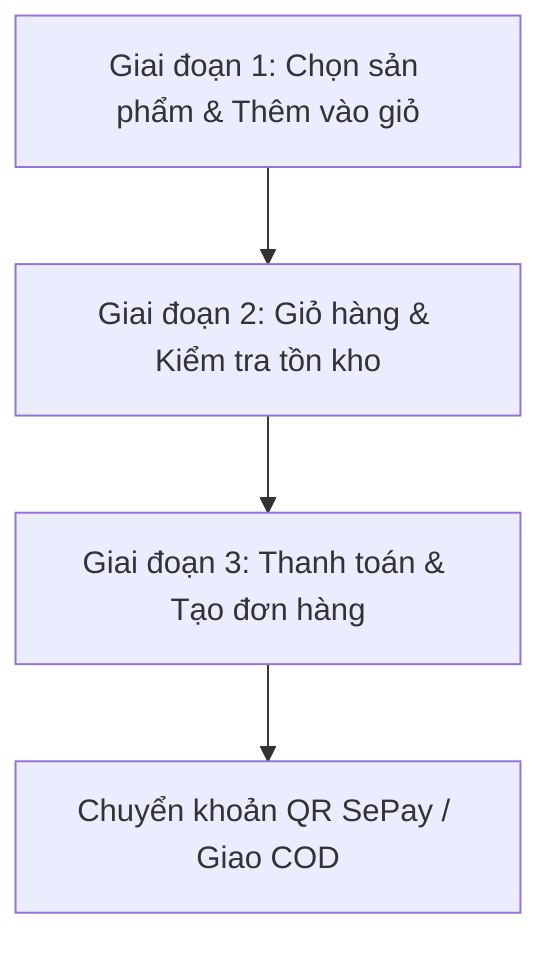
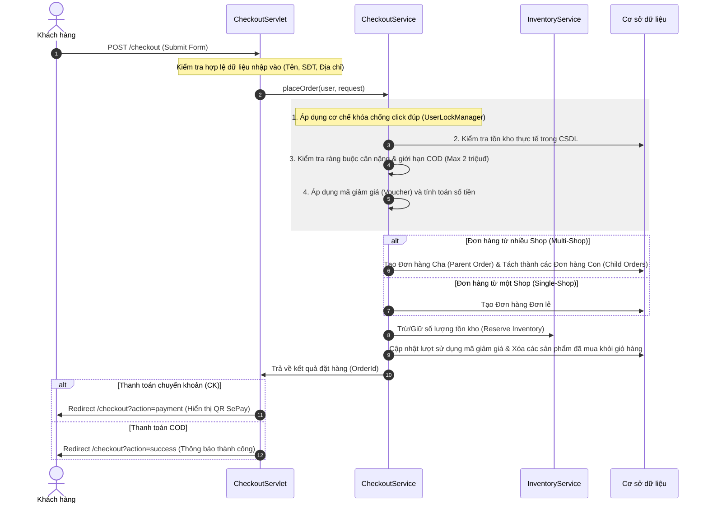

# Tài Liệu Hướng Dẫn Luồng Nghiệp Vụ: Chọn Sản Phẩm -> Giỏ Hàng -> Thanh Toán

Tài liệu này hệ thống hóa toàn bộ luồng xử lý từ giao diện người dùng (Frontend) đến logic nghiệp vụ hệ thống (Backend) và Cơ sở dữ liệu (Database) phục vụ cho việc thuyết trình trước Hội đồng chấm thi.

---

## 🗺️ Tóm Tắt Luồng Đi Tổng Quan (Overview Workflow)

Luồng hoạt động chính được chia thành 3 giai đoạn cốt lõi:



---

## 1. Chi Tiết Giai Đoạn 1: Chọn Sản Phẩm -> Thêm Vào Giỏ Hàng

### 🔹 Giao diện hiển thị (Frontend)
- Người dùng truy cập trang chi tiết sản phẩm ([product-detail.jsp](file:///d:/DMHoang/Project_GitHub/Ban_Hoa_Qua_Online/web/WEB-INF/jsp/guest/product-detail.jsp)).
- Lựa chọn **Biến thể sản phẩm (Variant)** (ví dụ: kích cỡ, khối lượng), **Loại bao bì (Packaging)** và **Số lượng**.
- Nhấn nút **Thêm vào giỏ hàng (Add to Cart)**.

### 🔹 Logic xử lý code (Backend & Client Script)
1. **Phía Client (JavaScript):**
   - Sự kiện click gọi Ajax gửi request POST đến URL `/cart` với các thông số:
     - `action=add`
     - `variantId` (Mã biến thể)
     - `quantity` (Số lượng)
     - `packagingId` (Mã bao bì chọn thêm, nếu có)
2. **Phía Server ([CartServlet.java](file:///d:/DMHoang/Project_GitHub/Ban_Hoa_Qua_Online/src/java/servlet/customer/cart/CartServlet.java) - phương thức `doPost`):**
   - **Trường hợp 1: Người dùng chưa đăng nhập (Guest):**
     - Trả về mã thành công để Client lưu giỏ hàng trực tiếp vào **Local Storage** của trình duyệt.
   - **Trường hợp 2: Người dùng đã đăng nhập (Customer):**
     - Gọi `CartService.addToCart(userId, variantId, quantity, packagingId)`.
     - `CartService` sẽ kiểm tra trong CSDL:
       - Nếu sản phẩm/biến thể đã tồn tại trong giỏ hàng (`cart_items`), thực hiện cập nhật cộng dồn số lượng (`quantity`).
       - Nếu chưa tồn tại, chèn bản ghi mới vào bảng giỏ hàng.
     - Trả về JSON chứa giỏ hàng cập nhật mới nhất thông qua `CartSummaryDTO`.

---

## 2. Chi Tiết Giai Đoạn 2: Từ Giỏ Hàng -> Bắt Đầu Thanh Toán (Checkout)

### 🔹 Giao diện hiển thị (Frontend)
- Người dùng vào trang giỏ hàng ([cart.jsp](file:///d:/DMHoang/Project_GitHub/Ban_Hoa_Qua_Online/web/WEB-INF/jsp/customer/cart.jsp)).
- Hệ thống hiển thị danh sách sản phẩm, giá bán, bao bì kèm theo và tổng tiền tạm tính.
- Người dùng tích chọn những sản phẩm muốn thanh toán và nhấn **Mua hàng**.

### 🔹 Logic xử lý code (Backend & Client Script)
1. **Kiểm tra tồn kho (Check Stock):**
   - Trước khi chuyển trang, client gửi Ajax POST đến `/cart?action=checkStock` kèm theo danh sách `variantIds`.
   - `CartServlet` gọi `CartService.checkCartStockBeforeCheckout()`.
   - Phương thức này đối chiếu số lượng yêu cầu của khách hàng với số lượng thực tế trong kho (`ProductVariant.stockQuantity`):
     - Nếu không đủ hàng, trả về thông báo lỗi chi tiết để hiển thị cảnh báo trên giao diện.
     - Nếu đủ hàng, tiến hành chuyển hướng sang trang thanh toán.
2. **Chuyển hướng đến trang Checkout:**
   - Trình duyệt chuyển hướng đến `/checkout?variantIds=1,2,3...` (chỉ gửi đi các sản phẩm được chọn).
   - [CheckoutServlet.java](file:///d:/DMHoang/Project_GitHub/Ban_Hoa_Qua_Online/src/java/servlet/customer/cart/CheckoutServlet.java) (`doGet`) tiếp nhận:
     - Gọi `CheckoutService.buildCheckoutView(user, variantIds)`.
     - Lấy danh sách địa chỉ nhận hàng của khách (`userAddressDAO.findByUser()`).
     - Tải thông tin tóm tắt giỏ hàng, tổng khối lượng và tính phí giao hàng (`DELIVERY_FEE_PER_SHOP` = 15.000đ mỗi shop).
     - Đẩy các thông tin này lên request attributes và forward đến giao diện thanh toán ([checkout.jsp](file:///d:/DMHoang/Project_GitHub/Ban_Hoa_Qua_Online/web/WEB-INF/jsp/customer/checkout.jsp)).

---

## 3. Giai Đoạn 3: Xác Nhận Đặt Hàng & Thanh Toán

### 🔹 Hành động người dùng
- Chọn địa chỉ nhận hàng, điền thông tin liên hệ (Tên, SĐT).
- Chọn khung giờ nhận hàng mong muốn.
- Nhập mã giảm giá (Voucher của Shop hoặc Voucher của Sàn).
- Chọn phương thức thanh toán: **COD (Thanh toán khi nhận hàng)** hoặc **Chuyển khoản ngân hàng**.
- Nhấn **Đặt hàng**.

### 🔹 Xử lý nghiệp vụ tại Backend ([CheckoutService.java](file:///d:/DMHoang/Project_GitHub/Ban_Hoa_Qua_Online/src/java/service/cart/CheckoutService.java))

Khi nhận request POST đến `/checkout`, luồng thực thi trong `CheckoutService.placeOrder()` như sau:



---

## 💡 Các Ràng Buộc & Quy Tắc Nghiệp Vụ Quan Trọng Cần Nhớ Khi Trả Lời Hội Đồng

Khi bảo vệ trước Hội đồng chấm thi, thầy cô thường hỏi các góc cạnh kỹ thuật hoặc kiểm thử hộp đen. Dưới đây là các cơ chế thông minh đã được tích hợp trong code:

1. **Cơ chế khóa đồng thời (Anti Double-Submit - `UserLockManager`):**
   - Sử dụng `ReentrantLock` theo `userId` nhằm chặn việc nhấn nút "Đặt hàng" liên tiếp tạo ra nhiều đơn hàng trùng lặp.
2. **Quy tắc phân chia đơn hàng (Multi-Shop Split):**
   - Khi giỏ hàng có sản phẩm từ nhiều shop khác nhau, hệ thống tự động gom nhóm theo từng Shop Owner, tạo một **Đơn hàng cha (Parent Order)** cho khách hàng theo dõi tổng quát, và tách thành các **Đơn hàng con (Child Order)** gửi về cho từng chủ shop chuẩn bị hàng.
3. **Giới hạn thanh toán COD (`PAY-01`):**
   - Nếu tổng giá trị đơn hàng vượt quá **2.000.000đ**, hệ thống sẽ chặn phương thức COD và bắt buộc khách hàng phải chọn chuyển khoản để đảm bảo an toàn giao dịch.
4. **Giới hạn trọng lượng đơn hàng (`DEL-02`):**
   - Để đảm bảo giao hàng hỏa tốc bằng xe máy, tổng trọng lượng sản phẩm được chọn không vượt quá **30 kg**.
5. **Cơ chế giữ hàng (Inventory Reservation):**
   - Số lượng sản phẩm được giảm trực tiếp trong CSDL tại thời điểm tạo đơn hàng thành công thông qua `InventoryService.reserve()`. Nếu đơn hàng bị hủy, số lượng này sẽ được hoàn trả lại kho.
6. **Thanh toán tự động bằng QR Code (SePay):**
   - Khi chọn chuyển khoản, hệ thống tự động sinh mã QR động chứa số tài khoản, số tiền và nội dung chuyển khoản mã hóa (Ví dụ: `FRUITMKTXXXXX`). Khách quét mã chuyển tiền, hệ thống sẽ xác nhận trạng thái đơn hàng tự động mà không cần kiểm tra thủ công.

---

## 🔬 Giải Thích Kỹ Thuật Chi Tiết (Phục Vụ Trình Bày Hội Đồng)

### 1. Cơ Chế Khóa Đồng Thời (Anti Double-Submit - `UserLockManager`)
* **Mục tiêu:** Chặn việc khách hàng click liên tục nút "Đặt hàng" (do mạng chậm hoặc cố ý) dẫn tới việc tạo ra nhiều đơn hàng trùng lặp và trừ kho sai lệch.
* **Nguyên lý hoạt động:**
  * Lớp [UserLockManager.java](file:///d:/DMHoang/Project_GitHub/Ban_Hoa_Qua_Online/src/java/util/UserLockManager.java) duy trì một `ConcurrentHashMap<Integer, ReentrantLock>` đóng vai trò quản lý các khóa (Lock) theo mã định danh người dùng (`userId`).
  * Khi yêu cầu đặt hàng tới, `CheckoutService` gọi `UserLockManager.getLock(userId)` để lấy khóa độc quyền cho user đó.
  * Hệ thống thử khóa trong 10 giây thông qua hàm `lock.tryLock(10, TimeUnit.SECONDS)`:
    * Nếu luồng trước đó đang xử lý chưa xong, khóa đang bị giữ, luồng sau sẽ bị chặn lại và ném ra ngoại lệ `IllegalStateException` ngay lập tức ("Yêu cầu của bạn đang được hệ thống xử lý...").
    * Nếu thành công, tiến hành xử lý logic đặt hàng bình thường. Sau khi kết thúc (dù thành công hay thất bại), luồng sẽ đi vào khối `finally` để giải phóng khóa bằng `lock.unlock()` và thu dọn bộ nhớ qua `UserLockManager.cleanUp()`.

#### 📌 Checklist Ghi Nhớ & Cải Tiến Kỹ Thuật cho cleanUp():
| Vấn đề | Ý nghĩa kỹ thuật |
| :--- | :--- |
| `computeIfAbsent` | Lấy lock nếu có sẵn trong map, nếu chưa có thì khởi tạo mới |
| `userId` | Mỗi user có một đối tượng lock riêng biệt |
| `ReentrantLock` | Lớp khóa của Java hỗ trợ đồng bộ, chặn nhiều luồng (thread) cùng vào vùng xử lý nhạy cảm |
| `lock.tryLock(...)` | Thử lấy lock trong một khoảng thời gian chờ, tránh đứng im hệ thống (deadlock) |
| `finally { lock.unlock() }` | Giải phóng khóa. Bắt buộc phải đặt trong khối `finally` để chắc chắn lock được mở |
| `cleanUp(userId)` | Giải phóng tài nguyên: Loại bỏ lock khỏi Map để tránh rò rỉ bộ nhớ (Memory Leak) khi hệ thống chạy lâu dài |
| `lock.isLocked()` | Kiểm tra xem lock có đang bị giữ bởi bất kỳ luồng nào hay không |
| `lock.hasQueuedThreads()` | Kiểm tra xem có luồng nào đang xếp hàng chờ lock này hay không |
| `locks.remove(userId, lock)` | Chỉ xóa lock khỏi map nếu khóa hiện tại vẫn khớp để tránh xóa nhầm lock mới được tạo bởi luồng khác |

* **Đoạn mã cải tiến của `cleanUp`:**
  ```java
  public static void cleanUp(int userId) {
      ReentrantLock lock = locks.get(userId);
      // Chỉ xóa khỏi map khi không có luồng nào giữ lock và không có luồng nào đang xếp hàng chờ
      if (lock != null && !lock.isLocked() && !lock.hasQueuedThreads()) {
          locks.remove(userId, lock);
      }
  }
  ```
* **Mẫu áp dụng chuẩn (Standard Locking Pattern):**
  ```java
  ReentrantLock lock = UserLockManager.getLock(userId);
  if (lock.tryLock(10, TimeUnit.SECONDS)) {
      try {
          // Thực hiện nghiệp vụ logic nhạy cảm (trừ tiền, đặt hàng...)
      } finally {
          lock.unlock(); // Luôn giải phóng khóa đầu tiên
          UserLockManager.cleanUp(userId); // Giải phóng tài nguyên map
      }
  }
  ```

> [!NOTE]
> Khóa Java ở cấp JVM (`UserLockManager`) chỉ giải quyết được việc trùng lặp request của **cùng một người dùng**. Để giải quyết tranh chấp tồn kho khi **nhiều người dùng khác nhau** cùng mua một sản phẩm cuối cùng tại một thời điểm, hệ thống kết hợp thêm:
> 1. **Database Transaction:** Thiết lập chế độ Auto-Commit bằng `false` và `connection.commit()` để bảo đảm tính nguyên tử (Atomicity).
> 2. **Pessimistic Locking / Row-Level Lock:** Sử dụng câu lệnh SQL cập nhật có điều kiện ở lớp DAO để CSDL tự khóa dòng dữ liệu:
>    `UPDATE product_variants SET stock_quantity = stock_quantity - ? WHERE variant_id = ? AND stock_quantity >= ?`

---

### 2. Quy Tắc Phân Chia Đơn Hàng (Multi-Shop Order Split)
* **Mục tiêu:** Cho phép khách hàng chọn mua sản phẩm từ nhiều cửa hàng khác nhau trong cùng một giỏ hàng, đồng thời vẫn đảm bảo mỗi chủ cửa hàng chỉ quản lý phần đơn hàng thuộc về mình.
* **Nguyên lý hoạt động:**
  * Trong `CheckoutService.placeOrder()`, hệ thống tiến hành gom nhóm các sản phẩm được chọn theo mã định danh của chủ shop (`ownerId`) bằng phương thức `groupItemsByOwnerId()`.
  * Nếu số lượng shop tham gia lớn hơn 1, hệ thống kích hoạt phương thức `placeMultiShopOrder()`:
    1. **Tạo Đơn Hàng Cha (Parent Order):** Lưu trữ tổng giá trị đơn hàng, tổng phí vận chuyển của tất cả các shop cộng lại và tổng tiền giảm giá. Đơn hàng cha này được gán cột `order_type = 'PARENT'`.
    2. **Tạo Các Đơn Hàng Con (Child Orders):** Duyệt qua từng shop, tính toán riêng số tiền phụ thu bao bì, giá trị sản phẩm của shop đó. Đơn hàng con được gán `order_type = 'CHILD'` và lưu tham chiếu `parent_order_id` trỏ về Đơn hàng cha.
    3. **Phân Phối Mã Giảm Giá:** Nếu khách hàng nhập voucher của sàn (System Coupon), hệ thống sử dụng thuật toán phân phối tỷ lệ `allocateDiscount()` để chia đều số tiền giảm giá của sàn vào từng đơn hàng con tương ứng dựa trên giá trị đơn hàng của từng shop.
    4. **Thông báo chuẩn bị hàng:** Gửi thông báo hệ thống và email độc lập tới từng Shop Owner để họ chuẩn bị đóng gói sản phẩm.

---

### 3. Tự Động Hóa Thanh Toán Bằng QR Code Động (Tích Hợp SePay)
* **Mục tiêu:** Giúp khách hàng thanh toán chuyển khoản nhanh chóng không cần gõ thủ công thông tin chuyển khoản và giúp hệ thống xác nhận thanh toán tự động ngay khi tiền vào tài khoản.
* **Nguyên lý hoạt động:**
  1. **Tạo Yêu Cầu Thanh Toán:** Khi khách chọn thanh toán Chuyển khoản ngân hàng (`AppConfig.PAYMENT_CK`), đơn hàng sẽ có trạng thái ban đầu là `AppConfig.ORDER_PENDING_PAYMENT`. `CheckoutService` gọi `PaymentService.initPayment()` để tạo một bản ghi giao dịch trong bảng `payment_transactions` với trạng thái `pending`.
  2. **Sinh Mã QR Động (VietQR):** Hệ thống tự động tạo mã tham chiếu thanh toán duy nhất (`sepayReference` - định dạng e.g. `MF001` tương ứng đơn hàng #1) qua phương thức `buildSepayReference()`. Mã QR động được render trên giao diện qua API SePay:
     `https://qr.sepay.vn/img?bank={BANK_ID}&acc={ACCOUNT_NO}&amount={AMOUNT}&des={REFERENCE}&template=compact`
     Mã QR này nhúng sẵn số tiền chính xác cần chuyển khoản và nội dung chuyển khoản chính là mã tham chiếu `sepayReference`.
  3. **Xử Lý Webhook Tự Động:** 
     * Khi khách hàng quét mã và chuyển tiền thành công, hệ thống SePay nhận biến động số dư ngân hàng và ngay lập tức gửi một request HTTP POST chứa dữ liệu giao dịch (JSON) về Webhook URL của ứng dụng (`/api/payment/webhook`), xử lý bởi `PaymentService.processWebhook()`.
     * `PaymentService` kiểm tra trùng lặp giao dịch (`insertDedup()`), đối chiếu số tiền thực tế nhận được với số tiền của đơn hàng (`transferAmount >= expectedAmount`) và khớp nội dung chuyển khoản với mã tham chiếu.
     * Nếu khớp hoàn toàn, hệ thống tự động cập nhật trạng thái giao dịch thanh toán thành `completed` và cập nhật đơn hàng thành `AppConfig.ORDER_CONFIRMED` (Đã xác nhận), đồng thời bắn thông báo real-time cho khách hàng.
  4. **Xác Minh Thủ Công dự phòng:** Nếu có lỗi hệ thống hoặc không nhận được webhook, khách hàng nhấn nút "Tôi đã thanh toán" để đổi trạng thái giao dịch thành `processing`, thông báo cho Admin kiểm tra và phê duyệt thủ công trong trang quản trị.
